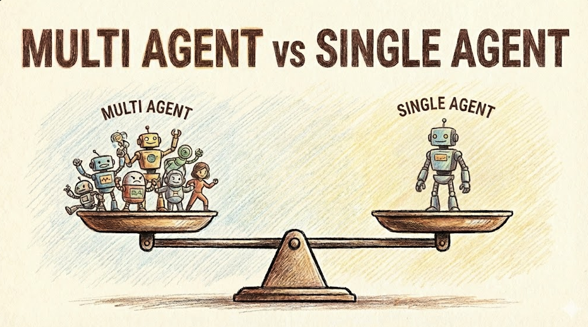
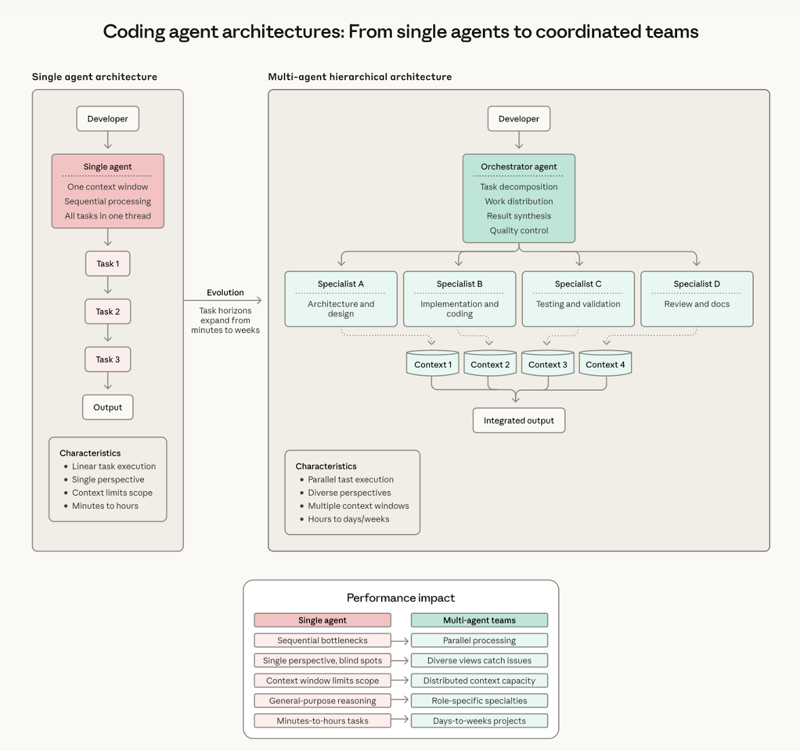

<!--

대규모 마이그레이션, 왜 멀티 에이전트가 아니라 싱글 에이전트로 했을까?


-->

<br />

<br />

## 시작하며

<br />

2026년의 AI 개발 도구 흐름을 보면 멀티 에이전트라는 키워드를 자주 보게 됩니다.

<br />

분석 에이전트, 구현 에이전트, 검증 에이전트, 리뷰 에이전트처럼 역할을 나누고, 각 에이전트가 독립적으로 움직이며 결과를 합치는 방식입니다. 이름만 들으면 꽤 그럴듯합니다. 특히 대규모 코드베이스를 대상으로 마이그레이션이나 리팩터링을 해야 한다면, 여러 에이전트를 동시에 투입하는 편이 더 효율적으로 보입니다.

<br />

하지만 제가 회사에서 마이그레이션을 진행해 보았을 때, 꼭 그렇지는 않았습니다.

<br />

예를 들어 Spring Boot 3.0대에서 3.5로 올리고, JDK도 21에서 25로 올리는 마이그레이션을 생각해 보겠습니다. 이런 작업은 단순히 버전 숫자만 바꾸는 일이 아닙니다. Spring Security 설정 변경, 의존성 충돌, deprecated API 제거, Jakarta EE 패키지 전환, Gradle 설정 수정, 테스트 실패 대응이 한꺼번에 터집니다.

<br />

이런 상황에서 처음에는 멀티 에이전트가 좋아 보입니다.

<br />

<br />
<center>
싱글 에이전트와 멀티 에이전트 구조 비교
</center>
<br />

그러나 실제로는 하나의 에이전트가 전체 맥락을 유지한 채 빌드 실패를 보고, 원인을 분석하고, 수정하고, 다시 빌드하는 방식이 더 안정적일 때가 많습니다.

<br />

이 글에서는 Anthropic의 [Building multi-agent systems: when and how to use them](https://claude.com/blog/building-multi-agent-systems-when-and-how-to-use-them)에서 제시한 기준을 바탕으로, 왜 대규모 마이그레이션 작업에서도 무조건 멀티 에이전트가 답은 아닌지 정리해 보겠습니다.

<br />
<br />
<br />

# 멀티 에이전트가 항상 더 좋은 것은 아니다

<br />

Anthropic 글의 핵심 메시지는 간단합니다.

<br />

정교한 멀티 에이전트 구조를 만들기 전에, 먼저 단일 에이전트의 프롬프트와 작업 흐름을 충분히 개선해 보라는 것입니다. 여러 팀이 복잡한 멀티 에이전트 시스템을 만들었지만, 단일 에이전트의 지시문을 개선하는 것만으로 비슷한 결과를 얻는 경우가 있었다고 설명합니다.

<br />

멀티 에이전트가 의미 있는 경우는 대체로 세 가지입니다.

<br />

**1. Context Pollution**

<br />

- 이전 작업에서 생긴 정보가 이후 판단을 오염시킬 때.
- 예를 들어 고객 주문 이력 수천 줄을 분석한 뒤, 전혀 다른 기술 장애를 진단해야 하는 경우.
- 이때는 이전 컨텍스트를 분리하는 편이 판단 품질을 높일 수 있습니다.

<br />

**2. Parallelization**

<br />

- 서로 독립적인 작업을 동시에 처리해야 할 때.
- 예를 들어 아시아 시장 트렌드와 유럽 시장 트렌드를 동시에 조사하는 것처럼, 결과가 서로에게 영향을 주지 않는 경우.
- 이때는 병렬 작업으로 시간을 줄일 수 있습니다.

<br />

**3. Specialization**

<br />

- 완전히 다른 전문성이나 서로 다른 도구 묶음이 필요할 때.
- 예를 들어 CRM API, 마케팅 자동화 API, 메시지 플랫폼 API를 모두 한 에이전트에게 맡기면 도구 선택이 복잡해질 수 있습니다.
- 이때는 역할별 에이전트 분리가 도움이 됩니다.

<br />

반대로 이 세 가지 조건이 강하지 않다면, 멀티 에이전트는 오히려 오버헤드를 추가합니다.

<br />

에이전트를 나누면 각 에이전트가 별도 컨텍스트를 유지해야 하고, 에이전트 사이의 결과 전달도 필요합니다. 작업 자체보다 인수인계와 조정 비용이 커질 수 있습니다.

<br />
<br />
<br />

# 마이그레이션 작업에 대입해 보기

<br />

대규모 프레임워크 마이그레이션은 겉보기에는 병렬화하기 좋아 보입니다. 파일도 많고, 에러도 많고, 수정할 지점도 많기 때문입니다.

<br />

하지만 실제 빌드 기반 마이그레이션은 대부분 다음 루프를 반복합니다.

<br />

```txt
빌드 실행
→ 에러 확인
→ 원인 분석
→ 관련 파일 수정
→ 다시 빌드 실행
→ 다음 에러 확인
```

<br />

이 흐름은 생각보다 순차적입니다. 이전 빌드 결과를 보지 않고 다음 수정을 결정하기 어렵습니다. 하나의 수정이 다음 에러를 만들기도 하고, 반대로 여러 에러를 한 번에 없애기도 합니다.

<br />

그렇기 때문에 단순히 역할별로 에이전트를 쪼갠다고 해서 작업이 빨라지지는 않습니다.

<br />
<br />
<br />

## 1. Context Pollution 관점

<br />

마이그레이션 작업은 하나의 맥락이 처음부터 끝까지 이어집니다.

<br />

예를 들어 `SecurityConfig.java`에서 Spring Security 설정을 바꾼다고 해보겠습니다. 에이전트는 단순히 컴파일 에러 한 줄만 보면 안 됩니다. 이 서비스가 어떤 인증 방식을 쓰는지, CSRF 설정은 왜 이렇게 되어 있는지, 직전 빌드에서 어떤 파일을 이미 수정했는지, 같은 패턴이 다른 설정 파일에도 있는지 함께 알아야 합니다.

<br />

이런 정보를 분석 에이전트, 수정 에이전트, 검증 에이전트 사이에서 계속 넘기면 맥락이 깎입니다. 처음에는 정확했던 정보가 요약되고, 생략되고, 잘못 해석될 수 있습니다.

<br />

이를 흔히 귓속말 게임(telephone game)에 비유할 수 있습니다.

<br />

> 정보를 한 사람에게서 다음 사람에게 넘길 때마다 디테일이 조금씩 사라지는 현상입니다. 에이전트도 마찬가지입니다. 핸드오프가 많아질수록 처음 판단에 필요했던 맥락이 줄어들고, 그 결과 엉뚱한 수정이 생길 수 있습니다.

<br />

마이그레이션처럼 연속적인 판단이 필요한 작업에서는 컨텍스트를 분리하기보다, 하나의 에이전트가 핵심 맥락을 계속 들고 가는 편이 더 유리할 수 있습니다.

<br />
<br />
<br />

## 2. Parallelization 관점

<br />

빌드 기반 마이그레이션은 병렬화하기 어려운 부분이 많습니다.

<br />

물론 파일 단위로 보면 여러 파일을 동시에 고칠 수 있을 것처럼 보입니다. 그러나 컴파일 에러는 서로 연결되어 있습니다. 의존성 하나를 바꾸면 import 에러가 사라지고, 그 다음에는 런타임 설정 에러가 드러나는 식입니다.

<br />

또한 같은 패턴의 에러라도 도메인마다 의미가 다를 수 있습니다. 단순히 전체 파일을 나눠서 여러 에이전트가 동시에 고치면, 한 에이전트가 고친 방향과 다른 에이전트가 고친 방향이 충돌할 수 있습니다.

<br />

이런 작업은 병렬 처리보다 작은 루프를 빠르게 도는 것이 중요합니다.

<br />

```txt
작게 수정한다
→ 바로 빌드한다
→ 결과를 보고 다음 결정을 한다
```

<br />

이 흐름에서는 여러 에이전트를 동시에 돌리는 것보다, 하나의 에이전트가 빌드 결과를 누적해서 이해하는 편이 더 안정적입니다.

<br />
<br />
<br />

## 3. Specialization 관점

<br />

마이그레이션에 사용하는 도구는 생각보다 많지 않습니다.

<br />

보통 필요한 것은 파일 읽기, 검색, 수정, 빌드 실행, 테스트 실행, 로그 분석 정도입니다. 모두 같은 도메인, 즉 코드 수정과 검증에 속합니다.

<br />

이 정도 작업을 위해 분석 에이전트, 수정 에이전트, 검증 에이전트를 별도로 두면 역할은 그럴듯해 보이지만 실제 이득은 작을 수 있습니다. 오히려 각 에이전트가 같은 파일을 다시 읽고, 같은 빌드 로그를 다시 요약하고, 서로의 결과를 다시 확인하는 비용이 늘어납니다.

<br />

전문성 분리가 필요한 경우는 도구와 도메인이 정말 달라질 때입니다.

<br />

예를 들어 한쪽은 결제 API 정책을 조사하고, 다른 한쪽은 인프라 비용을 분석하고, 또 다른 한쪽은 프론트엔드 접근성 문제를 점검한다면 멀티 에이전트가 의미 있습니다. 그러나 하나의 Java/Spring 마이그레이션 안에서는 단일 에이전트가 충분한 경우가 많습니다.

<br />
<br />
<br />

# 실제로는 어떻게 구성하는 것이 좋을까?

<br />

멀티 에이전트로 나누기 전에 먼저 단일 에이전트가 일을 잘할 수 있는 구조를 만들어야 합니다.

<br />

핵심은 세 가지입니다.

<br />

1. 프로젝트 컨텍스트를 고정한다.
2. 반복 작업의 절차를 명시한다.
3. 컨텍스트 오염이 심한 일부 작업만 분리한다.

<br />
<br />
<br />

## 1. 프로젝트 컨텍스트 파일

<br />

프로젝트 루트에 에이전트가 항상 읽는 컨텍스트 파일을 둡니다. Claude Code라면 `CLAUDE.md`, Codex라면 `AGENTS.md`나 작업 지침 파일이 이 역할을 할 수 있습니다.

<br />

여기에는 매번 설명하지 않아도 되는 프로젝트 고유 지식을 적습니다.

<br />

```markdown
# service-api 마이그레이션 가이드

## 기술 스택
- Spring Boot: 3.0.x → 3.5.x 마이그레이션 진행 중
- JDK: 21 → 25 마이그레이션 진행 중
- 패키징: 기존 WAR 패키징 유지
- 주요 변경: Spring Security 설정 변경, Jakarta EE 패키지 기준 적용

## 작업 원칙
- 비즈니스 로직 변경 금지
- API 호환성 유지
- javax.* 중 Java SE 기본 API(javax.imageio, javax.sql 등)는 변경 대상 아님
- 프론트엔드 빌드는 Java 마이그레이션과 무관하면 건드리지 않음
- 실패한 테스트는 원인을 분류한 뒤 최소 수정으로 해결
```

<br />

이 파일이 있으면 에이전트는 매 세션마다 프로젝트의 기본 전제를 다시 물어볼 필요가 없습니다.

<br />
<br />
<br />

## 2. 마이그레이션 작업 레시피

<br />

그다음에는 마이그레이션 흐름을 명확한 작업 레시피로 만듭니다.

<br />

예를 들어 다음처럼 Phase를 나눌 수 있습니다.

<br />

```txt
Phase 1: 자동 마이그레이션
  → OpenRewrite 같은 도구로 가능한 변경을 먼저 적용
  → 자동 변경 결과를 검토하고 불필요한 설정 제거

Phase 2: 수동 의존성 정리
  → Spring Boot 버전, JDK 버전, 플러그인 버전 업데이트
  → 호환되지 않는 라이브러리 교체

Phase 3: 컴파일 빌드 루프
  → ./gradlew clean build -x test
  → 에러 분류
  → 최소 수정
  → BUILD SUCCESSFUL까지 반복

Phase 4: 테스트 루프
  → 실패한 테스트만 우선 분석
  → 테스트 실패 원인이 제품 코드인지 테스트 코드인지 구분
  → 전체 테스트 통과까지 반복
```

<br />

여기서 중요한 것은 에이전트에게 행동 원칙을 분명히 주는 것입니다.

<br />

```txt
- 빌드가 성공할 때까지 반복한다.
- 비즈니스 로직은 바꾸지 않는다.
- 같은 에러가 3회 반복되면 접근 방식을 바꾼다.
- 에러 메시지를 그대로 믿지 말고 관련 설정과 호출부를 함께 확인한다.
- 큰 리팩터링보다 컴파일과 동작 호환성을 먼저 맞춘다.
```

<br />

이런 지시가 있으면 단일 에이전트도 꽤 긴 작업을 안정적으로 이어갈 수 있습니다. 멀티 에이전트 설계보다 먼저 개선해야 할 지점은 이 부분입니다.

<br />
<br />
<br />

## 3. 그래도 분리하면 좋은 지점

<br />

그렇다고 모든 작업을 무조건 하나의 에이전트에게 몰아야 한다는 뜻은 아닙니다.

<br />

분리하면 좋은 지점도 있습니다. 대표적으로 빌드 로그 분석입니다.

<br />

빌드 에러 로그는 길고, 대부분은 한 번 분석하고 나면 다시 볼 필요가 없습니다. 로그 원문 수백 줄이 메인 컨텍스트에 계속 남아 있으면 이후 판단에 노이즈가 됩니다.

<br />

이때 별도 분석 에이전트나 서브 작업으로 빌드 로그를 넘기고, 메인 에이전트에는 필요한 요약만 돌려주는 방식이 유용합니다.

<br />

```markdown
# build-analyzer 역할

1. 빌드 로그를 읽는다.
2. 에러를 컴파일 / 의존성 / 설정 / 테스트 실패로 분류한다.
3. 관련 파일과 원인을 추정한다.
4. 수정이 필요한 파일 경로와 권장 수정 방향만 반환한다.
5. 불필요한 로그 원문은 반환하지 않는다.
```

<br />

이 방식은 역할 나누기라기보다 컨텍스트 오염을 줄이기 위한 분리입니다.

<br />

핵심 판단과 수정은 여전히 메인 에이전트가 가져가고, 빌드 로그처럼 일회성으로 큰 정보만 따로 처리합니다. 이것이 멀티 에이전트를 무작정 구성하는 것보다 더 실용적인 절충안입니다.

<br />
<br />
<br />

# 토큰과 비용 이야기

<br />

멀티 에이전트는 보기보다 비용이 큽니다.

<br />

Anthropic 글에서는 동일한 작업에서 멀티 에이전트 구현이 단일 에이전트 접근보다 훨씬 더 많은 토큰을 쓰는 경우가 많다고 설명합니다. 각 에이전트가 별도 컨텍스트를 유지하고, 서로의 결과를 주고받고, 핸드오프를 위해 요약을 생성해야 하기 때문입니다.

<br />

마이그레이션 작업에서는 이 비용이 더 커질 수 있습니다.

<br />

분석 에이전트가 빌드 로그를 읽습니다. 수정 에이전트에게 요약합니다. 수정 에이전트는 다시 파일을 읽습니다. 검증 에이전트가 빌드를 돌립니다. 실패하면 다시 분석 에이전트에게 넘깁니다.

<br />

이 과정에서 실제 수정은 몇 줄인데, 에이전트 사이의 설명과 요약이 더 길어질 수 있습니다.

<br />

반면 단일 에이전트는 같은 컨텍스트 안에서 이전 판단과 수정 이력을 바로 이어받습니다. 잘 설계된 작업 지침이 있다면 토큰을 더 적게 쓰면서도 안정적인 결과를 낼 수 있습니다.

<br />
<br />
<br />

# 도구가 많아지는 상황

<br />

멀티 에이전트가 필요해 보이는 또 다른 이유는 도구가 많아질 때입니다.

<br />

에이전트에게 도구를 제공한다는 것은, 프롬프트 안에 그 도구가 무엇을 하고 어떻게 쓰는지 설명한다는 뜻입니다. 도구가 20개, 30개로 늘어나면 에이전트는 매번 많은 도구 설명을 읽어야 합니다.

<br />

선택지가 너무 많으면 모델도 헷갈립니다. 비슷한 도구 중에서 엉뚱한 것을 고르거나, 실제로는 필요 없는 도구를 호출할 수 있습니다.

<br />

이때도 바로 멀티 에이전트로 나누기 전에 먼저 Tool Search 방식을 고려할 수 있습니다. 모든 도구를 한 번에 주는 대신, 필요한 순간에 도구를 검색해서 가져오게 하는 방식입니다.

<br />

예를 들어 도구 50개를 모두 프롬프트에 넣는 대신, 검색 도구 하나와 검색 결과 몇 개만 컨텍스트에 올립니다. 이렇게 하면 도구 설명으로 낭비되는 토큰을 줄일 수 있습니다.

<br />

즉, 도구가 많다는 이유만으로 에이전트를 나누기보다 먼저 도구 노출 방식을 최적화하는 것이 좋습니다.

<br />
<br />
<br />

# 만약 역할 기반 멀티 에이전트로 했다면?

<br />

마이그레이션을 역할 기반으로 나누면 보통 이런 구성이 됩니다.

<br />

```txt
분석 에이전트 → 수정 에이전트 → 검증 에이전트 → Orchestrator
```

<br />

구조만 보면 깔끔합니다. 그러나 실제 시나리오에서는 문제가 생깁니다.

<br />

분석 에이전트가 "SecurityConfig.java의 filterChain 설정을 최신 방식으로 수정하라"고 전달합니다. 수정 에이전트는 파일을 엽니다. 그런데 이 파일이 왜 현재 인증 방식을 쓰는지, 어떤 Filter와 연결되어 있는지, 직전 빌드에서 어떤 설정 파일을 이미 바꿨는지 모릅니다.

<br />

맥락 없는 수정은 새로운 에러를 만들 수 있습니다. 그러면 검증 에이전트가 실패를 발견하고, 다시 분석 에이전트로 넘깁니다. 이 루프가 반복되면 실제 수정 시간보다 에이전트 간 메시지 교환이 더 많아집니다.

<br />

반면 단일 에이전트는 같은 컨텍스트 안에서 다음을 함께 추적합니다.

<br />

- 방금 어떤 파일을 바꿨는지
- 왜 그렇게 바꿨는지
- 같은 패턴이 다른 파일에도 있는지
- 다음 빌드 실패가 이전 수정과 관련 있는지

<br />

이런 작업에서는 한 명의 숙련된 작업자가 전체 흐름을 잡고 가는 편이 더 낫습니다. AI 에이전트도 마찬가지입니다.

<br />
<br />
<br />

# 마치며

<br />

에이전트 설계에서 중요한 것은 겉으로 보이는 복잡함이 아닙니다. 실제로 일을 끝내는 데 필요한 구조를 선택하는 것입니다.

<br />

대규모 마이그레이션이라고 해서 반드시 멀티 에이전트가 필요한 것은 아닙니다. 작업이 순차적이고, 이전 수정 맥락을 계속 필요로 하며, 사용하는 도구와 도메인이 크게 갈라지지 않는다면 싱글 에이전트가 더 안정적인 선택일 수 있습니다.

<br />

추천하는 접근은 단순합니다.

<br />

먼저 프로젝트 컨텍스트를 고정합니다. 그다음 반복 작업의 절차를 명확히 적습니다. 그리고 빌드 로그 분석처럼 컨텍스트를 오염시키는 일부 작업만 별도로 분리합니다.

<br />

멀티 에이전트는 강력한 도구입니다. 하지만 먼저 물어봐야 할 질문은 "몇 개의 에이전트를 쓸 것인가?"가 아닙니다.

<br />

> 이 작업은 정말 컨텍스트를 나눠야 하는가?<br />
> 병렬화할 수 있는가?<br />
> 서로 다른 전문성이 필요한가?

<br />

이 질문에 명확히 답할 수 있을 때 멀티 에이전트는 의미가 있습니다. 그렇지 않다면, 잘 설계된 싱글 에이전트가 더 단순하고 더 강한 선택일 수 있습니다.

<br />
<br />

*참고: [Building multi-agent systems: when and how to use them (Anthropic)](https://claude.com/blog/building-multi-agent-systems-when-and-how-to-use-them)*
