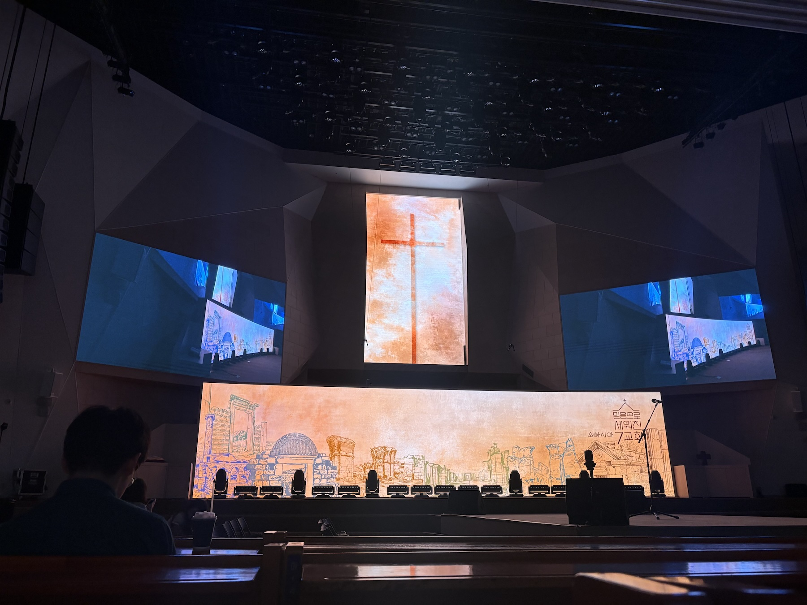
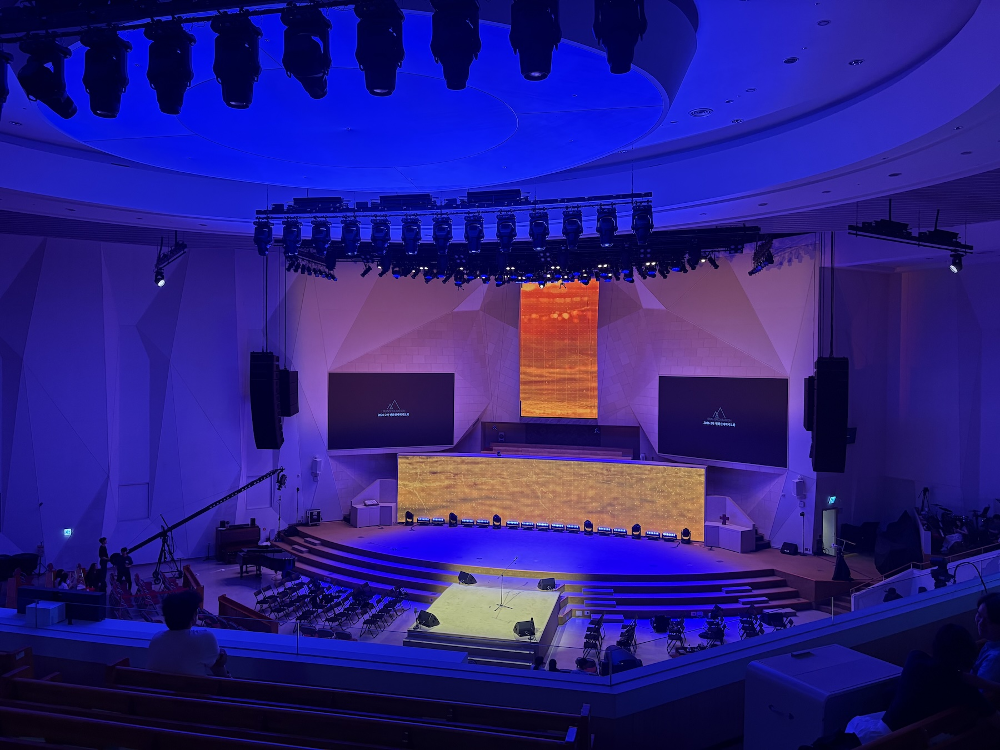

 
 
 

아래의 기록은 교회를 평가하거나 판단하려는 말이 아니라, 처음 방문한 사람이 보고 느낀 장면들입니다.

 
 
 

## 만나교회(08/09 - 주)

 

 

8월 9일, 분당에서 청년들이 많이 모이는 교회로 알려진 만나교회에 다녀왔습니다. 오후 2시 30분 청년예배였습니다. 

 

__#첫인상__

김병삼 목사님의 설교는 2025년 4C4와 예배교회 컨퍼런스에서 처음 들었습니다. 그때 목사님은 교회가 편의를 제공하는 곳은 아니라고 말씀하셨습니다. 본 교회는 주차가 불편하고 밥을 주지 않아도 불만이 없다는 취지의 말씀이 기억에 남습니다.

만나교회도 주차가 쉽지 않을 것이라 생각했는데, 광고 영상을 보니 건물 옆 주차 공간이 있었고 성남시청도 이용할 수 있다고 영상 광고가 나왔습니다. 실제 상황은 모르겠지만, 목사님의 말씀을 너무 극단적으로 들었나 생각도 해보았습니다.

 
 
 

__#청년예배__

청년부 예배를 담임목사님이 직접 인도하고 설교하시는 모습이 좋았습니다. 청년들이 담임목사님의 말씀을 듣는 것은 참 귀하고 좋은 일이라고 생각합니다.

설교 중 목사님이 청년들에게 대답을 요청하는 순간들이 있었는데, 모두가 정말 큰 목소리로 잘 대답했습니다. 예배가 침체되어 있지 않다는 것이 자연스럽게 느껴져 신기했습니다. 사람이 많고 청년들의 반응이 살아 있는 예배였습니다.

 
 
 

__#예배__

목사님의 건강이 좋지 않아 앉아서 설교하신다는 것은 알고 있었습니다. 그날은 앉아서 축도도 하셨는데, 낯설면서도 상황에 맞게 예배를 섬기는 모습이라 신선하게 다가왔습니다. 찬양이 끝난 뒤 목회기도로 예배가 시작되는 순서도 인상적이었습니다.

 

설교 본문은 요한계시록 2장 1절부터 7절, 에베소 교회 이야기였습니다. 설교 전에 작년 만나교회 성지순례 영상을 활용해 본문 배경을 보여주셨습니다. 청년들이 말씀을 더 잘 이해할 수 있도록 돕는 설교 방식처럼 보여 좋았습니다.

 
 
 

__#예배준비__

 

예배 10분 전에는 기도 시간이라는 안내가 있었지만, 본당은 꽤 시끌했습니다. 직전 교회에서는 예배 10분 전 기도회를 인도했기에 더 눈에 들어왔을지도 모르겠습니다. 예배를 기도로 준비하는 시간이 조금 더 분명했다면 어땠을까 하는 생각은 들었습니다.

 

물론 사람이 많아 서로 교제할 시간이 부족했을 수도 있고, 워낙 많은 인원이 좋은 예배 자리를 찾기 위해 일찍 움직이는 분위기일 수도 있습니다. 어느 쪽이든 처음 온 사람의 시각일 뿐입니다.

 
 
 

__#안내__

 

직전 교회에서는 웰컴팀으로 입구에서 인사한 경험이 있습니다. 그때는 지나가시던 어른들이 왜 입구에 서 있느냐고 물으시곤 해서, 안내 역할이 조금 더 잘 보이면 좋겠다는 생각을 했었습니다.

 

만나교회 안내팀은 같은 색상의 옷을 입고 있어 한눈에 알아보기 좋았습니다. 처음 온 사람, 특히 초신자는 누가 어떤 역할을 하는지 모르기 쉽습니다. 중간 광고를 진행하신 목사님이 동그랗고 큰 명찰을 차고 계신 것도 그런 점에서 좋아 보였습니다.

 
 
 

__#찬양과환경__

 

찬양 예배에서는 조명을 정말 잘 사용한다는 인상을 받았습니다. 찬양 가운데는 기프티드의 「사랑한다 말하시네」를 편곡한 곡도 있었습니다.

 

예배교회 컨퍼런스에서 들었던, 예배 때 마실 것을 가져오게 하는 안내와 흡연실에 대한 이야기도 떠올랐습니다. 교회가 많은 사람이 함께 예배드리는 현실적인 환경을 어떻게 다루는지도 생각하게 됐습니다.

 
 
 

__#공간__

 

탄천을 따라 걷다가 그대로 교회로 들어갈 수 있었습니다. 큰길에서 건물로 들어서는 동선이 아니라 산책로에서 이어지는 길이라, 교회에 간다기보다 동네를 걷다 들른다는 느낌에 가까웠습니다.

 

1층에서는 미술 전시가 열리고 있었습니다. 예배를 드리러 온 사람만 오가는 공간이 아니라, 지역 주민과 소통하는 공간으로서의 교회를 생각하게 됐습니다.

 

야외와 카페, 3층 본당까지 삼삼오오 모여 이야기를 나눌 수 있는 자리가 많았습니다. 예배가 끝난 뒤 곧바로 흩어지지 않고 어딘가에 앉아 이야기를 이어갈 수 있다는 점이 눈에 들어왔습니다.

 
 
 

__#주보__

 

주보는 따로 보이지 않았습니다. 이전 교회에서 종이 주보가 일회성으로 사라졌을 때는 아쉬웠는데, 주보가 없는 방식도 이 교회가 선택한 예배 문화의 한 모습처럼 느껴졌습니다. 처음 방문한 사람에게는 안내할 정보가 조금 더 있으면 좋겠다는 생각도 들었지만, 한 번의 방문만으로 단정할 일은 아닙니다.

 
 
 
