# 명저로 다시보는 자바와 메모리 이야기

<br>
<p align="center">
    
</p>
<br>

## 도입
&nbsp; 좋은 실력을 갖춘 개발자가 되기 위해서 단순히 자기의 코드가 돌아갔다 뿐 아니라 자신의 코드가 컴퓨터 내부에서 어떻게 동작하는지를 이해해야 합니다. 본 글은 간단한 JAVA 코드가 메모리에서 어떻게 동작하는지 살펴볼 것입니다 

<br />

## main() 메서드와 T 메모리

<p align="center">
    
</p>
- T메모리는 위와 같은 구조입니다. 


<br />

<p align="center">
    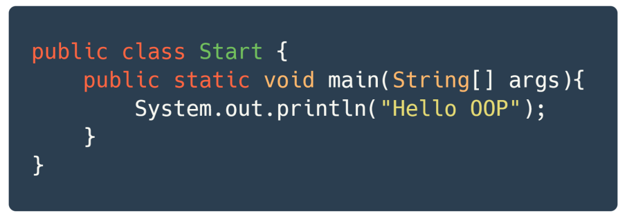
</p>


- JRE는 프로그램 안에 main() 메서드가 있는지 확인합니다.
- main() 메서드르 확인하면 JRE는 프로그램 실행을 위한 사전 준비를 합니다.
    - JVM에 전원을 넣어서 부팅합니다.
    - JVM은 목적 파일을 받아서 목적 파일을 실행합니다.   

<p align="center">
    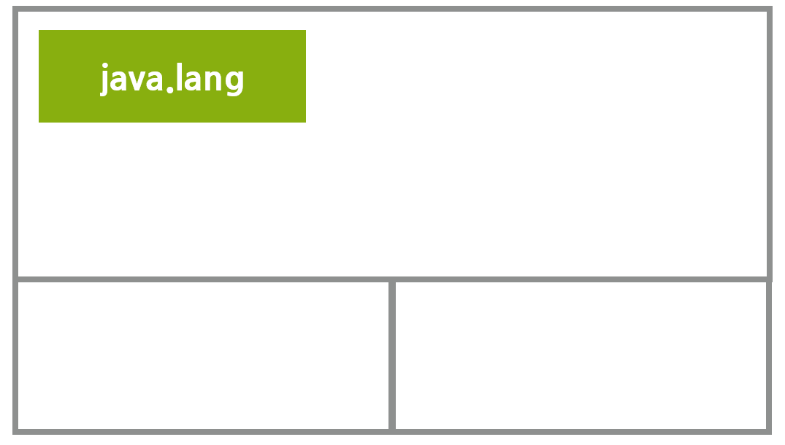
</p>

    - 모든 자바 프로그램이 반드시 포함하는 패키지인 `java.lang` 패키지를 T 메모리의 스태틱 영역에 가져 놓는다. 


<p align="center">
    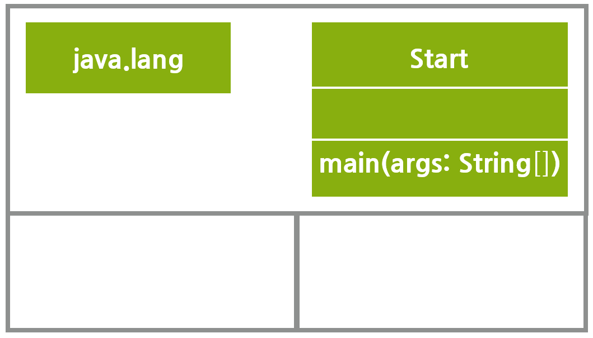
</p>

    - JAVM은 개발자가 작성한 모든 클래스와 임포트 패키지를 스태틱 영역에 가져다 놓는다. 
    - 스태틱의 별명은 클래스들의 놀이터 라고한다. 


정리하면 다음과 같다.
```
main() 메서드가 실행되기 전 JVM에서 수행하는 전처리 작업들
- java.lang 패키지를 T 메모리의 스태틱 영역에 배치한다.
- imort 된 패키지를 T 메모리의 스태틱 영역에 배치한다.
- 프로그램 상의 모든 클래스를 T 메모리의 스태틱 영역에 배치한다. 
```

<p align="center">
    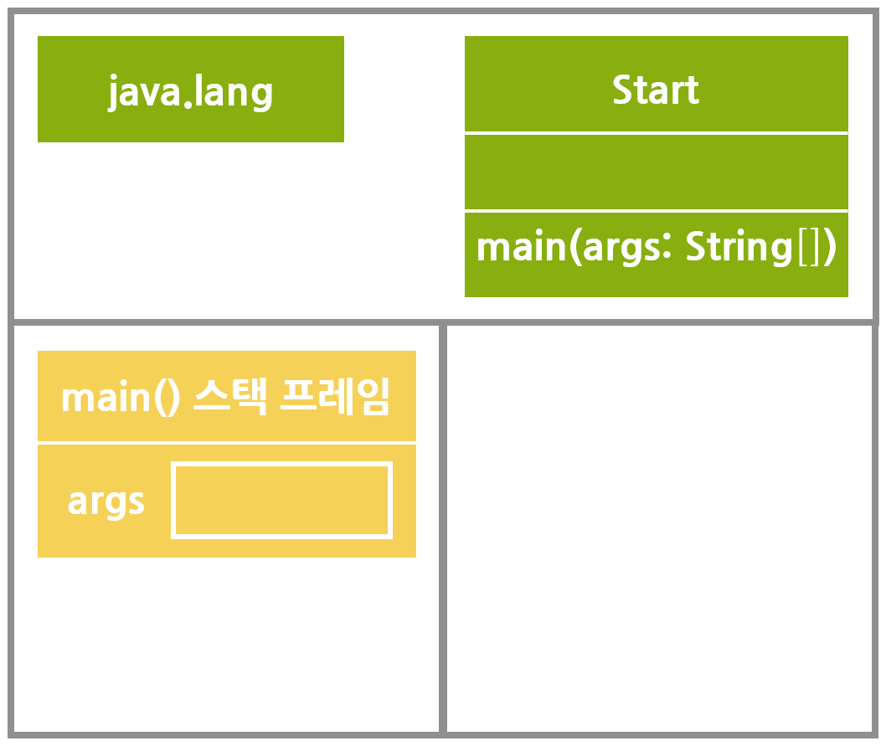
</p>

- main 메서드가 놀기 위해 스택 프레임이 스택영역에 할당됩니다. 
- 여기에 메서드의 인자 args를 저장한 변수 공간을 스택 프레임의 맨 밑에 확보한다. 
- 이 다음에 `System.out.println("Hello OOP");` 구문이 실행됩니다. 이 때 T 메모리에 변화는 없습니다. 


! 2-10
<p align="center">
    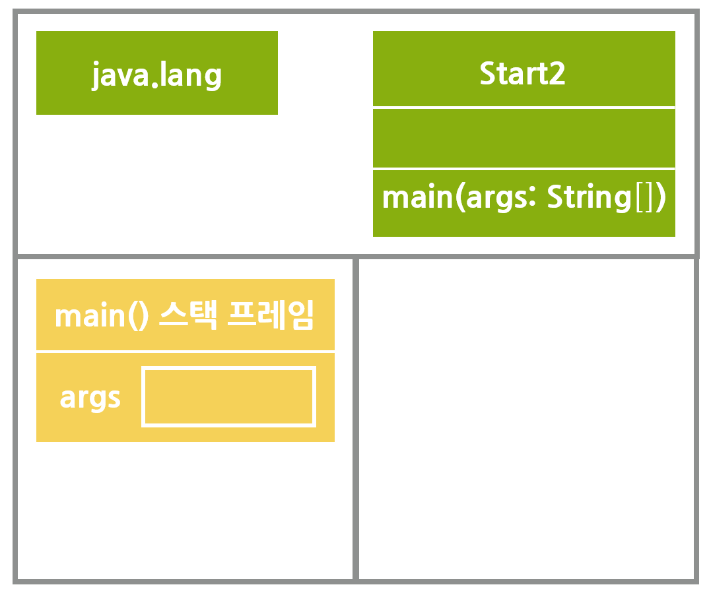
</p>
- main 메모리의 닫는 중괄호를 만나게 되면 스택 프레임은 소멸합니다. 
- 이렇게 스택 프레임은 여는 중괄호를 만나면 스택 프레임이 생기며, 닫는 중괄호를 만나면 소멸합니다.
- main() 메서드가 끝나면 JRE는 JVM을 종료하고 JRE 자체도 운영체제 상의 메모리에서 사라집니다. 그러면 T 메모리도 운명을 다하고 사라집니다.

<br />


## 변수와 T 메모리

<p align="center">
    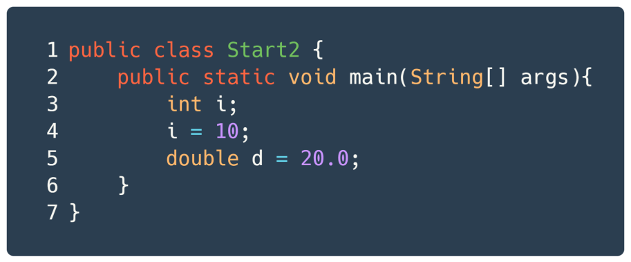
</p>


<p align="center">
    
</p>

- 2번째 줄을 실행한 상황은 위와 같습니다. 이렇게 표현되는 이유는 `main() 메서드와 T 메모리` 에서 설명했습니다.

<p align="center">
    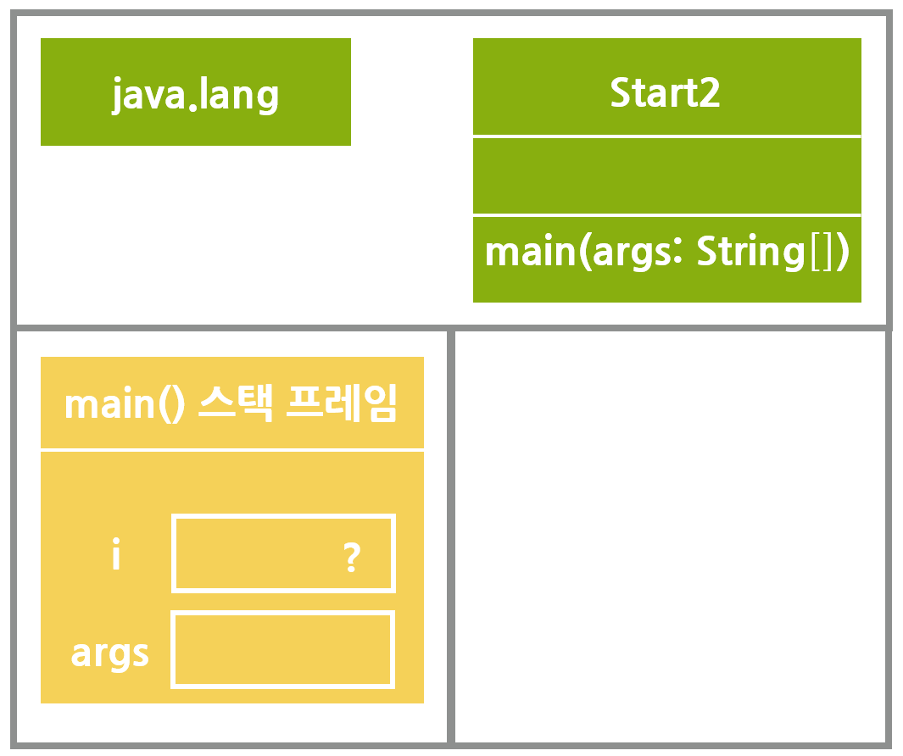
</p>

- ? 에는 알 수 없는 값이 들어가 있다는 뜻입니다. 
- 변수 i와 같이 선언만 하고 초기화를 하지 않은 상태에서 출력하려고 하면 자바 컴파일러(javac)는 "The local variable i may not have been initailized" 경고를 출력합니다. 

<p align="center">
    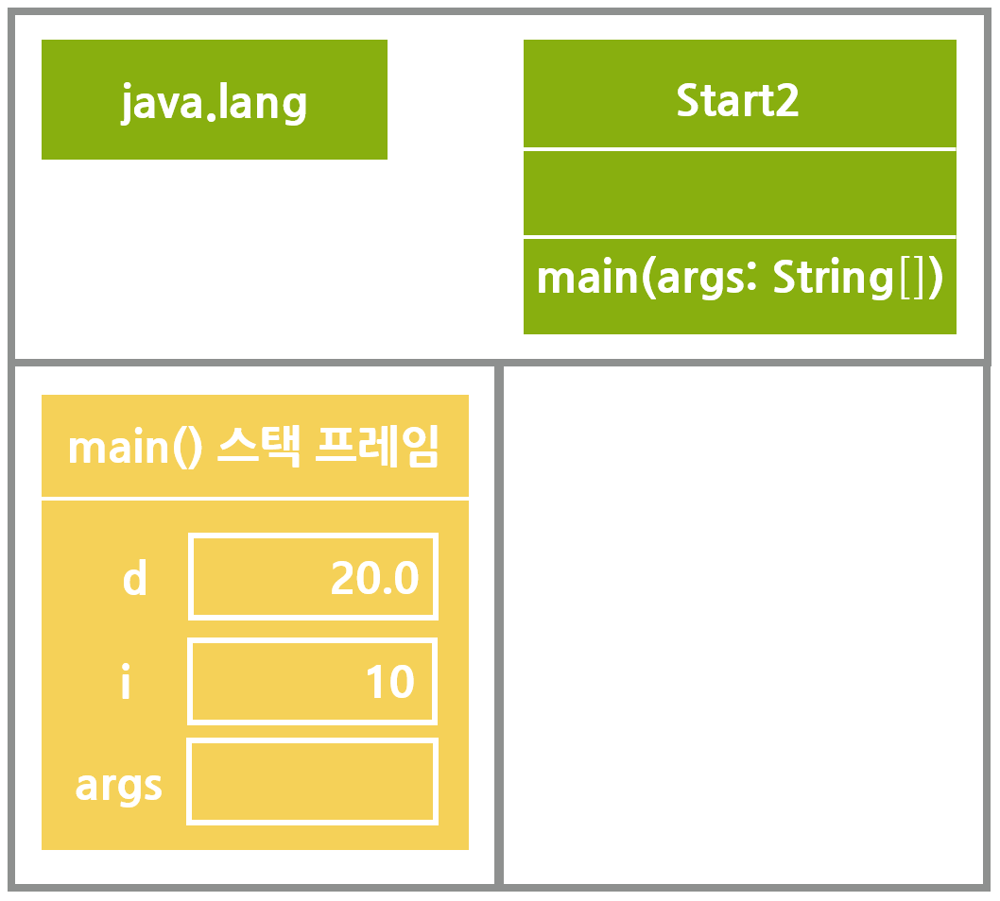
</p>
- 6번째 줄을 실행한 후 T 메모리의 상태는 위와 같습니다. 


<br />


## 블록 구분과 메모리: 블록 스택 프레임

<p align="center">
    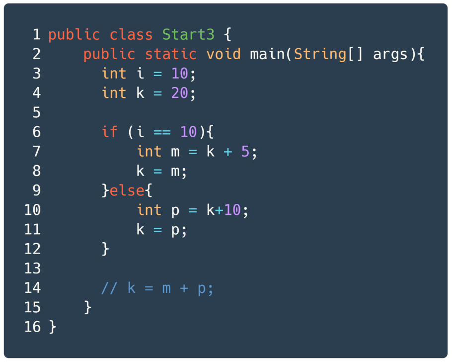
</p>

<p align="center">
    
</p>
2-20
- `변수와 T 메모리`를 통해서 4번 라인까지 실행하면 T 메모리에 어떻게 저장되는지 알 것입니다.
- if문은 T 메모리에 어떻게 기록될까요? if 는 조건문에 따라 분기가 일어납니다. i 에 저장된 값이 10이므로 참인 블록의 스택 프레임이 만들어집니다.

<p align="center">
    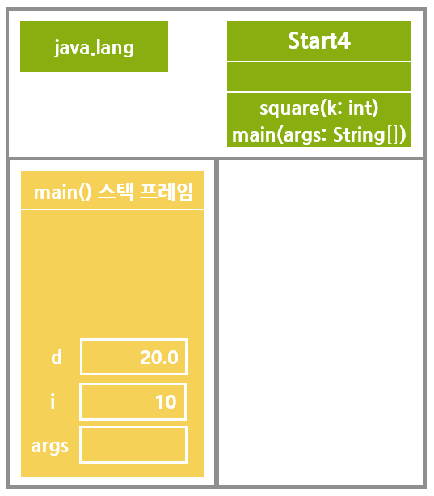
</p>
2-23
- if 블록 중 참일 떄의 블록을 종료하는 닫는 중괄호를 만나면 if 블록 스택 프레임은 스택 영역에서 사라집니다.
- if 블록 스택 프레임 안에 상주하던 변수의 저장 공간도 사라집니다. 
- 라인 20번의 주석을 해제하면 어떻게 될까요? 에러가 나올 것입니다. 
- m은 if 블록 스택 프레임이 종료되며 사라졌습니다. main이라는 외부 스택 프레임에서 내부 변수 m에는 접근 할 수 없습니다.
- 다음 사실을 기억해 주세요. "외부 스택 프레임에서 내부 스택 프레임의 변수에 접근하는 것은 불가능하나 그 역은 가능하다."


<br />


## 메서드 호출과 메모리: 메서드 스택 프레임


<p align="center">
    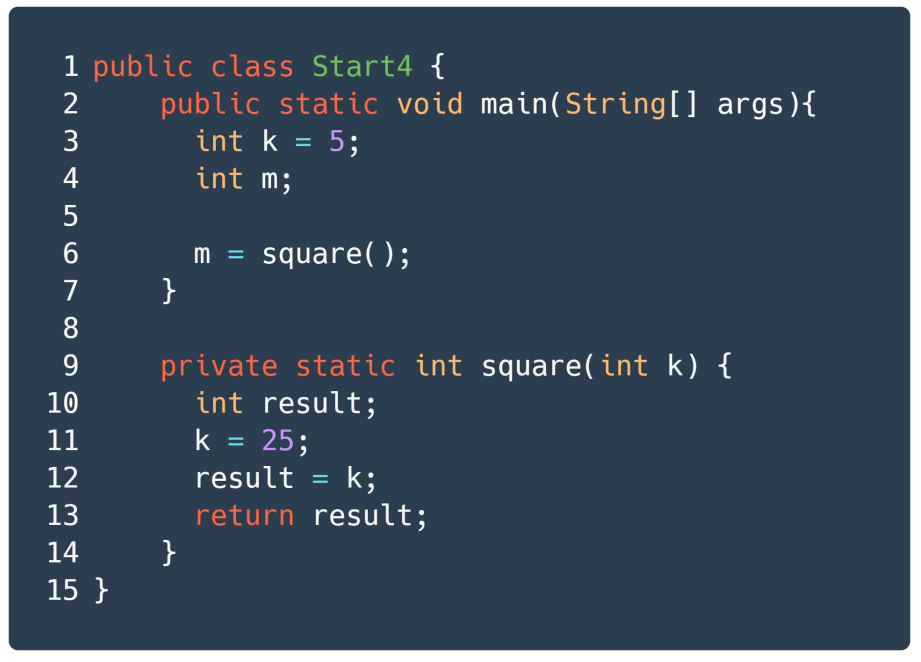
</p>

<p align="center">
    
</p>
! 2-29 + 32
<p> </p>
- 6번째 줄: square() 메서드를 호출합니다. 제어의 흐름이 square() 메서드가 선언된 9번째 줄로 이동할 것입니다.
- 위의 그림은 12번째 줄의 실행을 마쳤을 때 T 메모리의 스탭샷입니다.
- 주목해야할 것은 main() 메서드가 가진 변수 k와 square() 메서드가 가진 변수 k가 이름은 같지만 실제로는 별도의 공간에 존재한다는 것입니다. 이것을 `Call by Value(값에 의한 호출)` 이라고 합니다.
- 따라서 square() 메서드 안의 변수에 어떠한 값을 변경하더라도 main() 메서드 안의 k 변수는 영향이 없습니다.

<p align="center">
    
</p>
- 6번째 줄을 실행한 후 T 메모리 상태입니다.
  

<br />


## 전역 변수와 메모리

<p align="center">
    
</p>

<p align="center">
    
</p>
- share 변수에 static 키워드가 붙어 있습니다.
- share 변수는 T 메모리의 스태틱 영역에 변수 공간이 할당됩니다. 
- 3번째 줄을 실행하면 T 메모리에 main() 메서드 스택 프레임이 만들어집니다. 
- 이렇게 share 변수와 같은 변수를 전역 변수라고 합니다. 
- 전역 변수는 코드 어느 곳에서나 접근이 가능합니다. 여러 메서드들이 공유해서 사용한다고 해서 공유 변수라고도 합니다. 
- 그러나 프로젝트가 커져서 여러 메서드들이 전역 변수의 값을 변경하면 전역 변수에 어떤 값이 저장 되어 있는지 파악하기 쉽지 않습니다. 
- `Math.PI` 처럼 읽기 전용으로 값을 공유해서 전역 상수로 쓰는 것은 추천합니다. 


<br />


## 멀티 스레드 / 멀티 프로세스의 이해 

<p align="center">
    
</p>

<br>

<p align="center">
    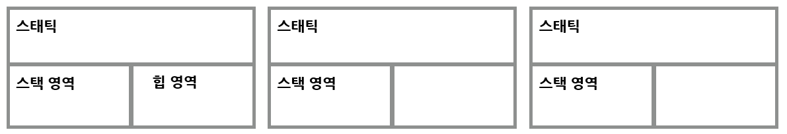
</p>

- 멀티 스레드의 T 메모리 모델은 스택 영역을 스레드 개수만큼 분할해서 쓰는 것입니다.
- 멀티 프로세스는 다수의 데이터 저장영역, 즉 다수의 T 메모리를 갖는 구조입니다. 
- 멀티 프로세스는 각 프로세스마다 각자의 T 메모리가 있고 각자 고유의 공간이므로 서로 참조할 수 없습니다. 
- 멀티 스레드는 하나의 T 메모리만 사용하는데 스택 영역만 분할해서 사용하는 구조입니다. 
- 멀티 프로세스는 하나의 프로세스가 다른 프로세스의 T 메모리 영역을 절대 침범 할 수 없는 메모리 안전한 구조이지만 메모리 사용량은 그 만큼 큽니다. 
- 멀티 스레드는 하나의 T 메모리 안에서 스택 영역만 분할한 것이기 떄문에 하나의 스레드에서 다른 스레드의 스택 영역에는 접근할 수 없지만 스태틱 영역과 힙 영역은 공유해서 사용하는 구조입니다. 따라서 멀티 프로세스 대비 메모리를 적게 사용할 수 있는 구조입니다.     


<br />
<br />
<br />
<br />

---------------
광고 꽝고~~~
