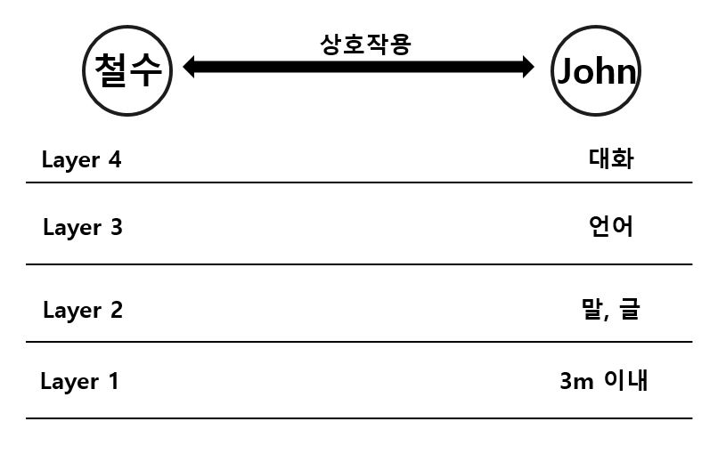
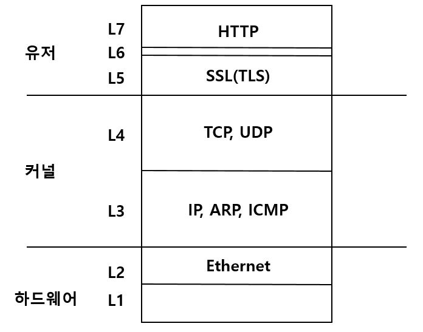
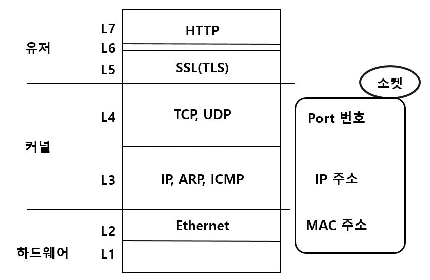
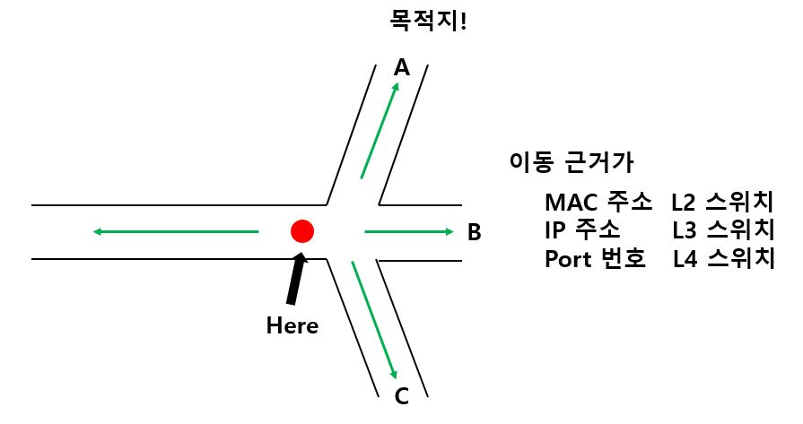
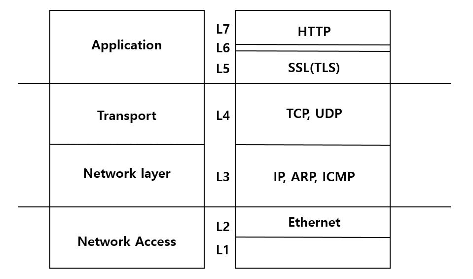

# 개념으로 이해하는 OSI 7 Layer와 네트워크
-------
* 본 포스트는 지금은 사라져버린 교육기관인 아이엘아이티 네트워크 강의를 수강후 재구성하였습니다.

### 도입

- **사람간의 네트워크**라는 말이 있다. 네트워크라는 말을 다른 말로 **연결관계**라고 할 수 있다. SNS를 사회 관계망 서비스라고 하는 것처럼! 네트워크는 **상호작용**이라고 할 수 있다. 사람들은 **대화**를 통해서 **상호작용** 한다.
- 철수가 올리비아하고 대화를 통해서 상호작용을 하는 상황을 보겠다.
  - 말로 할까? 글로 할까?
  - 3m이내 공기중으로 정했다.*(우주에서는 대화가 안될테니)*
  - 이렇게 자르고 보니 층져있다.
  - 이렇게 소통하기 위해 필요한 것을 규정해 놓고 대화를 풀어나가야 작용이 잘 된다는 것이다.
  - 왜 상호작용하냐는 목적이 빠져있다.

### OSI 7 레이어

- **OSI(Open System Interconnection) 7 Layer**를 사람과 소통의 관점에서 말을 바꾸어서 표현한다면 **성공적인 상호 작용을 위한 7가지 전재조건**이다.
- OSI 7Layer가 하나의 개념으로 컴퓨터 안에 구현되어있다. 유저, 커널, 하드웨어에 OSI 7Layer를 껴 넣을 수 있다. *[기억이 안난다면?](https://covenant.tistory.com/116)*
- 각 레이어 중에서 알아야 할 것을 설명하겠다.
- L2는 **이더넷**을 알아야 한다.
  - 이더넷은 하드웨어와 소프트웨어가 공존하고 있지만 하드웨어 쪽에 있는게 맞다.
- L3는 **IP프로토콜/ARP/ICMP** 애네들에 대해서는 반드시 공부를 해야한다. **IP/ARP**가 굉장히 중요하다. **ICMP**보다 중요하다.
  - 특히 보안하는 분들은 **ARP**를 꼭 알아라.
- L4에는 TCP가 압도적으로 중요하다.
  - UDP가 있는데 존재감이 떨어진다. *TCP가 워낙 정교하고 복잡하기 때문이다.*
- L5에는 **SSL(TLS)**가 있는데 사람들이 옛날이름인 **SSL**을 많이 쓴다.
- L6은 신경쓰지 말라.
- L7은 압도적으로 **HTTP**가 제일 중요하다.

### 맥, 아이피 주소, 포트 번호

**MAC주소**는 NIC(Network Interface Card)에 대한 식별자이다.
* MAC주소 예: 00-01-3D-AF-DA-C1
  * MAC주소는 16진수 00은 1byte이다.
  * MAC주소는 6*8 = 48 bit로 구성 즉 MAC주소는 48비트로 설명된다.
    * 16진수 한 글자가 4bit.
    * 그려면 00은 8비트, 01은 8비트 ... C1은 8비트 따라서 48비트로 구성
  * 자신의 MAC주소를 윈도우에서 알고 싶다면 커멘드 프롬프트에서 **ipconfig /all**로 하면 된다.

* **아이피 주소**는 호스트에 대한 식별자이다.
  * 일잔벅으로 컴퓨터는 아이피 주소를 한 개 갖는다.
  * 컴퓨터에 랜카드를 2개 꼽으면 NIC이 2개, IP주소는 2개가 된다.
  * IP주소 예: 192.168.0.1
* **포트번호**를 바라보는 두 가지 관점이 있다.
  * 프로세스에 대한 식별자라고 하면 개발자
  * 서비스에 대한 식별자라고 하면 관리자이다. __(80번 포트를 열어놔야 웹 서비스가 된다.)__
  * 포트번호는 16 bit unsigned integer로 1~65535(2^16개) 범위의 수를갖는다.
  * 하나의 호스트에서 개발할 수 있는 소켓의 최대 개수는 65535개이다.
  * 포트를 다 열면 열 수 있는 소켓이 없으므로 통신이 안 된다.  이 상태를 **서비스 거부상태** 라고 표현하나 **서비스 불가상태**라는 표현이 맞다고 생각한다.  

### 소켓
* 서로 다른 호스트의 프로세스끼리 네트워킹하려고 하면 소켓을 열어야한다.
* 소켓의 본질은 파일로 대상체이다. 주체는 프로세스이다. 프로세스가 소켓을 여는 것이다.
* 소켓은 기존에 파일 + a(IP주소, + Port + 프로세스 어드레스 패밀리 … )가 이루어져서 만들어진다. bind한다.(이에 대한 함수가 있다.)
  * **서버**쪽이면 **bind**, **클라이언트**면 **connect**이다.
  말 그대로 묶어주는 것이다.
  * 이런 소켓을 프로세스가 열면 어떤 포트번호인지 알면 따라가면 어떤 프로세스인지 나온다. 보통 프로세스는 PID라는 식별자를 가지고 있다.

### 스위치

*  랜케이블 꼽을 때 딸각 거리며 꼽는다.그 단자가 여러 개 붙어있는 장치를 허브(스위치)라고 한다.
* 하드웨어 수준에서 포트가 있다.
* 그 위에 LED가 깜박이고 숫자가 써 있다. 1번 포트에 랜 케이블을 꼽았다. 이 때는 인터페이스 번호이다. 우리말로 하면 단자번호 즘 된다.
* CISCO 자격증 공부하는 분들은 인터페이스번호라고 한다.
* 포트 번호라는 말이 카멜레온 같은 말이다.
* 애가 어느 환경에서 쓰느냐에 따라서 지칭하는 말이 달라지는 것이다.

* 어떤 출발지가 있는데 여기서 사람이 길을 나와서 갈림길이 있고 목적지로 간다. 어떤 사람이 길 위에 서있는데 갈림길에 만나는 것이다. 갈림길에 이정표가 있다. A나 C를 선택해야 한다. 목적지를 가기 위해서 A를 선택해야 한다. 이 사람은 갈림길에서 선택을 해야한다. 이 사람의 선택지는 4개가 있다.(A, B, C, 되돌아가기) 목적지로 가려면 당연히 A를 골라야한다. 이 갈림길을 스위치라고 한다. 선택은 스위칭(Switching)이다.
* 어떤 근거로 길을 선택할지가 괭장히 중요하다. 근거가 뭐냐에 따라서 애가 무슨 스위치인지 결정된다.
* 근거가 MAC주소라면 L2스위치가 될 것이다. L3스위치는 IP주소로 스위치하는 것이다. 포트로 스위치하면 L4스위치이다. HTTP트레픽에서 Post 필드로 스위칭한다. 그러면 L7스위치가 된다. 가격은 위로 갈수록 비싸진다. 고려해야할 변수가 느려나서 연산 규칙, 능력도 복잡해지고 메모리가 많이 사용해야 하니, 하드웨어가 좋아야 하기 때문
* 사고가 발생했다는 것을 보았다. 사고가 났다는 사실을 갈림길들이 보고 있어야 거기로 갈지 말지 결정한다. 스위치들이 서로 통신하고 있다. 이 통신하는 규칙, 즉 프로토콜이 있기 마련이다. 대표적으로 스패닝트리(Spanning tree) 프로토콜, 라우팅 프로토콜 같은게 있다. L3스위치인데 주변애들하고 통신해서 어느 경로가 좋은것인지 나쁜 것인지 통신한다. 그런 L3스위치는 라우터이다. 라우터의 본질은 L3 스위치이다. L4로 스위치 할 수 있다.

* OSI 7Layer를 DOD(Depart of Defense) 즉 미국 방위성에서 이렇게 나눈다. 밑 부분을 **Network access(Access Layer), Network layer, Transport Layer, Application Layer**가 나온다.
