<!--
케이뱅크 전세대출 갈아타기 후기
-->

## 시작하며

 

올해 4월, 살고 있는 오피스텔 전세 계약의 만기를 앞두고 국민은행 대출을 유지할지 다른 은행으로 갈아탈지 고민했습니다.

 

회사 복지로 전세대출 이자 지원을 받고 있어 선택할 수 있는 은행이 많지는 않았습니다. 우선은 국민은행의 우대금리 조건도 충족하고 있어 그대로 유지하는 쪽을 먼저 생각했습니다. 그런데 비대면으로 대출을 접수해 보니 금리가 4% 초반으로 기존 금리보다 훨씬 높았습니다. 그래서 대출이자 지원되는 은행 중에서 제일 괜찮은 은행인 케이뱅크로 전세대출을 갈아탔습니다

 

국민은행 대출은 MOR 금리를 기준으로 산정됐는데, 당시 제가 확인한 조건에서는 코픽스 금리보다 높았습니다. 그래서 코픽스 연동 상품을 중심으로 조건을 다시 비교했고, 결과적으로 케이뱅크로 갈아타기를 진행하게 됐습니다.

 

처음에는 굳이 후기를 남길 생각이 없었습니다. 다만 케이뱅크에서 전세대출 갈아타기를 진행한 최근 후기가 많지 않아, 같은 고민을 하는 분들께 참고가 될까 싶어 기록해 봅니다.

 
 
 

## 1. 네이버페이에서 전세대출 조건 비교하기

 
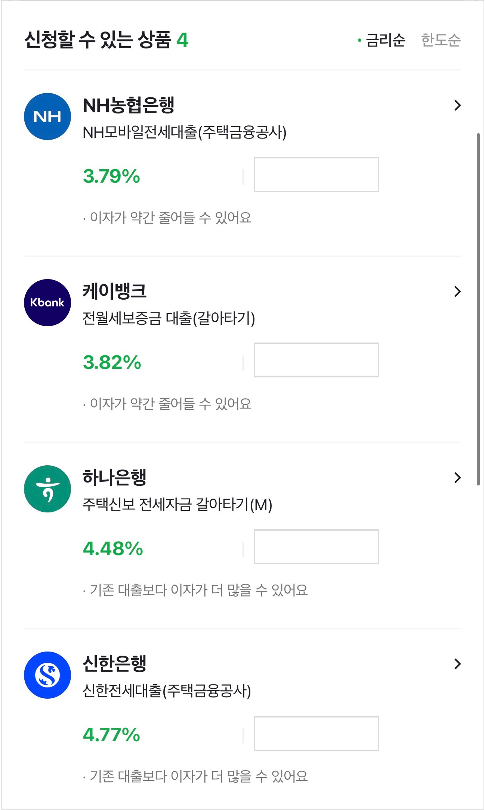
 

2026년 3월에 조회한 조건입니다. 이후 기준금리가 변동됐으므로 현재 조건과는 차이가 있을 수 있습니다.

 

실제 금리와 한도는 본심사를 거쳐야 확정되지만, 먼저 [네이버페이 대출비교](https://loan.pay.naver.com/n/jeonse)에서 대략적인 조건을 확인했습니다.

조회 결과 농협의 조건이 가장 낮게 보였지만, 회사의 대출이자 지원 대상 은행이 아니었습니다. 지원을 받을 수 있는 은행 가운데 케이뱅크의 조건이 괜찮아 케이뱅크로 신청했습니다.

 
 
 

## 2. 케이뱅크 앱에서 갈아타기 신청하기

 
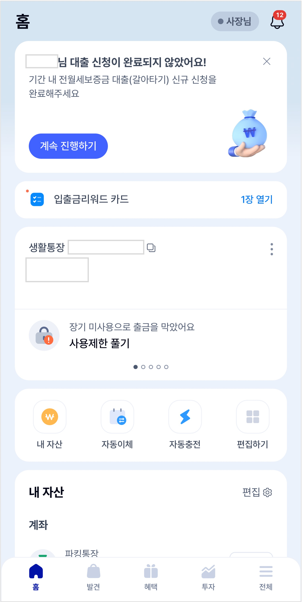
 

케이뱅크 앱의 대출 상품 안내 화면

 

네이버페이에서는 조건 비교까지만 가능했고, 케이뱅크 대출을 신청하려면 케이뱅크 앱으로 이동해야 했습니다. 앱에서 전월세보증금 대출 갈아타기 신청을 시작할 수 있습니다.

 

케이뱅크에는 당시 아래와 같은 전세대출 상품이 있었습니다.

 

1. 전세대출 (2년 고정금리)
2. 전세대출 (6개월 변동)
3. 청년전세대출 (6개월 변동)

 

고정금리 전세대출은 2년 만기에 연 3.3%로 가장 좋아 보였지만, 제게는 신청 불가로 표시됐습니다. 고객센터에서는 내부 심사 기준을 안내하기 어렵다고 했고, 공개된 상품 정보만으로는 정확한 사유를 알기 어려웠습니다. 전달받기로는 저신용자 대출로 신용등급이 낮아야 가능할것 같다고 말씀하셨습니다.. 결국 일반 전세대출인 6개월 변동금리 상품으로 신청했습니다.

 
 
 

## 3. 예상 조회와 서류 제출

 
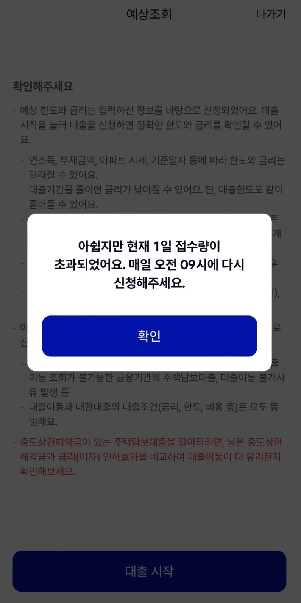
 

케이뱅크는 일일 대출 접수 물량이 정해져 있어 늦은 시간에는 접수가 마감될 수 있습니다. 갈아타기 신청이 몰리던 때에는 오전 9시 직후 접수가 마감됐다는 이야기도 있었는데, 제가 신청한 시점에는 그 정도는 아니었습니다.

 
 
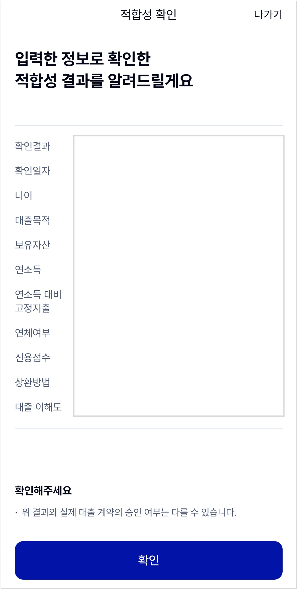
 
 

나이, 신용점수(KCB 기준), 보유자산, 연소득, 연소득 대비 고정지출 등을 바탕으로 대출 적합성을 확인합니다.

 
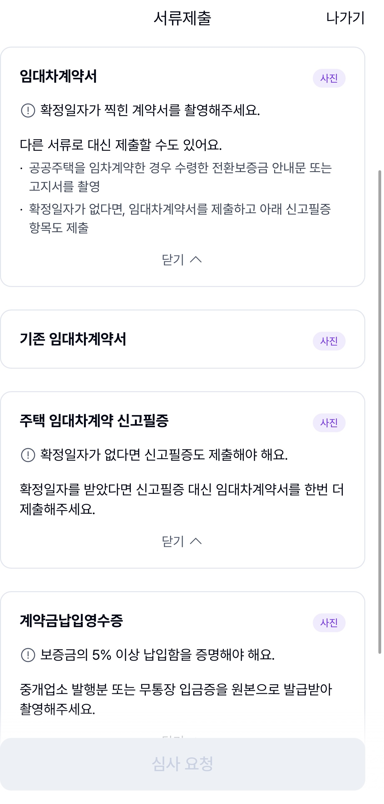
 

임대차계약서와 계약금 납입영수증 제출 안내

 

서류 제출 단계에서는 필요한 서류를 휴대폰으로 촬영해 제출하면 됩니다.

 

1. 임대차 계약서
2. 기존 임대차 계약서
3. 주택 임대차계약 신고필증
4. 계약금 납입영수증

 

임대차계약서는 확정일자가 찍힌 계약서를 촬영해야 했습니다. 확정일자가 없다면 임대차계약서와 함께 주택 임대차계약 신고필증도 제출해야 할 수 있습니다.

 

계약금 납입영수증은 보증금의 5% 이상을 납입한 사실을 확인할 수 있어야 한다고 안내돼 있었습니다. 저는 2년 전세 계약을 연장하는 경우라, 당시 어느 은행에서 계약금을 이체했는지 기억이 나지 않아 조금 난감했습니다. 토스에서 과거 이체 내역을 확인해 간신히 찾아 제출했습니다.

 
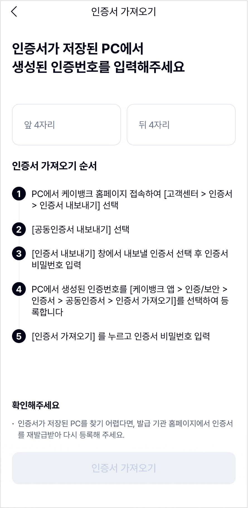
 

공동인증서를 가져오는 과정이 가장 번거로웠습니다.

 

서류 제출을 위해 공동인증서가 필요했습니다. 다소 번거롭기는 했지만, 맥을 사용하는 환경에서도 안내에 따라 인증서를 가져와 등록할 수 있었습니다.

 
 
 
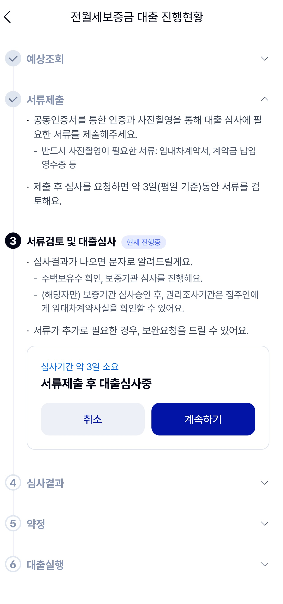
 

서류 제출을 마치면 심사 결과를 기다리면 됩니다.

 

 

신청을 한 번에 끝내지 못해도 앱에서 이어서 진행할 수 있어 편했습니다.

 

 

서류를 제출한 뒤에는 3영업일 이내에 서류 검토와 대출 심사가 진행된다는 안내가 나왔습니다.

 

 

심사 결과는 문자로 알려주며, 주택 보유 수 확인과 보증기관 심사도 함께 진행된다고 되어 있었습니다. 신청 조건에 따라 추가 서류를 요청받을 수도 있으니 앱 알림과 문자를 확인해 두는 편이 좋겠습니다.

 
 
 

## 4. 심사 결과에서 확인한 갈아타기 조건

 

심사 결과 화면에서는 기존 대출을 전액 갈아타거나 필요한 금액만큼 이동할 수 있었습니다. 제 화면에는 기존 대출 잔액과 동일한 금액을 전액 갈아타는 조건이 표시됐습니다.

 

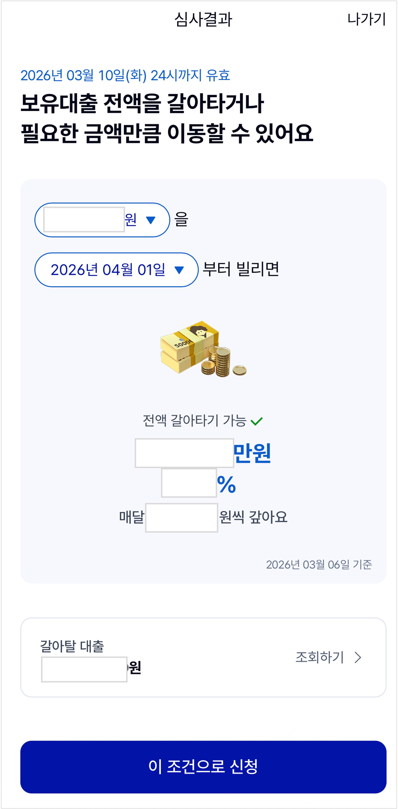

 

심사 결과에서 확인한 전액 갈아타기 조건

 

국민은행 대출과 마찬가지로 만기일시상환 방식이며, 대출 기간은 2년으로 안내됐습니다.

 

가장 눈에 띈 차이는 중도상환해약금이 없다는 점이었습니다. 여유자금이 생기면 수수료 부담 없이 상환할 수 있습니다. 제가 이용하던 국민은행 상품은 우대금리를 받기 위해 카드 실적과 앱 접속 이력 등을 관리해야 했는데, 케이뱅크에서는 별도의 우대 조건을 맞추지 않아도 화면에 표시된 조건으로 진행할 수 있었습니다.

 

기존 대출 상세 화면에서는 갈아탈 대출의 잔액과 예상 상환금액, 이자금액, 중도상환해약금도 함께 확인할 수 있었습니다. 새 대출의 한도가 넉넉해 보여도 기존 대출을 실제로 얼마에 상환해야 하는지 확인해야 하는 이유입니다.

 
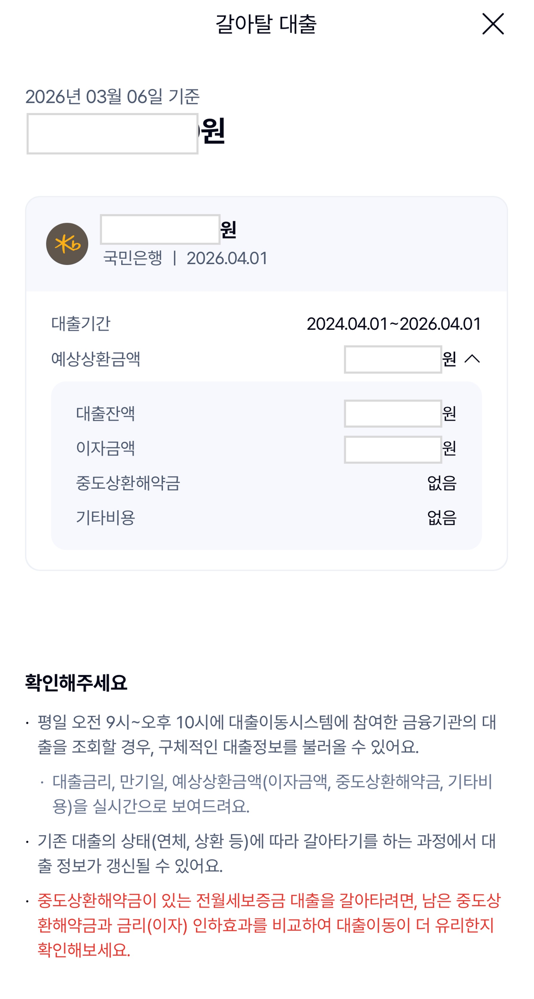
 

갈아탈 기존 전월세보증금 대출의 상환 정보

 

 
 

## 5. 금리는 실행일에 다시 확인해야 한다

 

심사 결과 화면의 금리는 기준금리와 가산금리를 합한 안내 금리였습니다. 당시에는 신규취급액 기준 코픽스 6개월물 금리에 가산금리가 더해진 것으로 표시됐습니다.

 
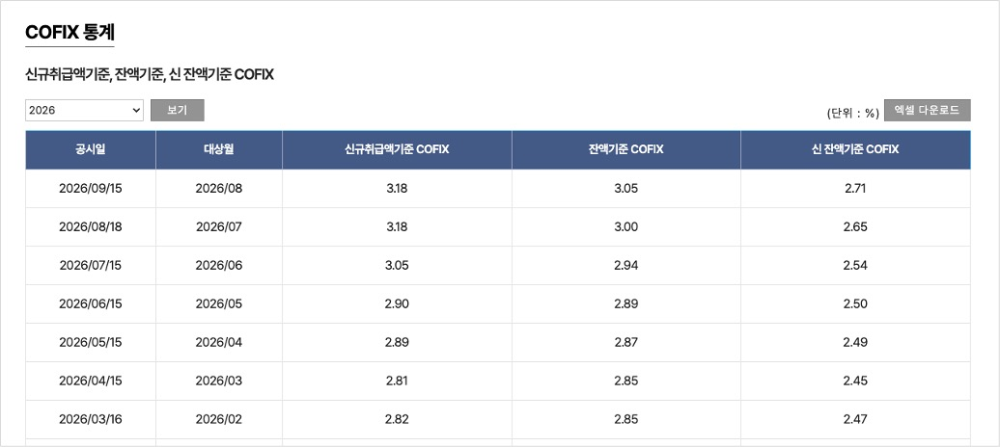
 

기준금리와 가산금리로 구성된 대출금리 안내

 

중요한 점은 화면의 금리가 승인일 기준이라는 것입니다. 최종 기준금리는 대출 실행일에 확정되므로, 심사 결과를 확인한 날의 금리만 보고 최종 금리라고 생각하면 안 됩니다.

 

진행 중인 상품의 기준금리 변동 주기는 6개월입니다. 2년 동안 코픽스 금리 기준으로 세번 금리가 변경되고 가산금리는 변경되지 않습니다.

 
 
 

## 6. 약정 전에 꼭 준비해야 했던 비용

 

약정 단계에서는 대출 조건과 함께 실행일에 출금될 비용을 확인해야 합니다. 필수비용과 기존 대출 이자까지 포함한 예상 필요금액이 함께 표시됩니다.

 

 

약정 단계에서 확인한 필수비용과 예상 필요금액

 

이번에는 새 대출금과 기존 대출 잔액이 같아 대출 차액이 없었습니다. 다만 대출 실행 당일 케이뱅크 입출금 계좌의 잔액이 안내된 필요금액보다 부족하면 실행이 취소될 수 있습니다. 실행일 직전에 계좌 잔액을 다시 확인해야 합니다.

 
 
 

## 7. 약정 완료 후에는 실행일을 기다리면 된다

 

약정을 마치고 실행일을 지정하면 대출은 실행 대기 상태가 됩니다. 제 화면에는 2026년 4월 1일에 실행하는 것으로 표시됐고, 대출 이동은 실행일 오전 9시 10분 전후 자동으로 진행된다고 안내됐습니다.

 
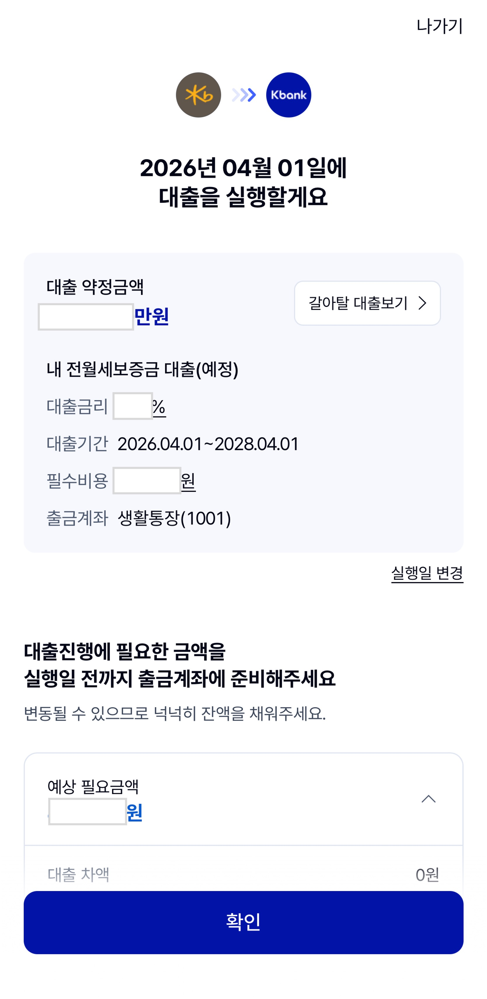
 

실행일과 출금계좌 잔액 준비 안내

 

실행일까지는 새 대출을 추가로 받거나 대출/신용카드 결제를 연체하는 등 신용점수에 변동을 줄 수 있는 일도 조심해야 합니다. 기존 대출이 연체 중인 경우, 실행일이 기존 대출의 이자 납부일 또는 자동이체일과 겹치는 경우, 출금계좌 잔액이 부족한 경우에도 대출 이동이 중단될 수 있다고 안내돼 있었습니다.

 
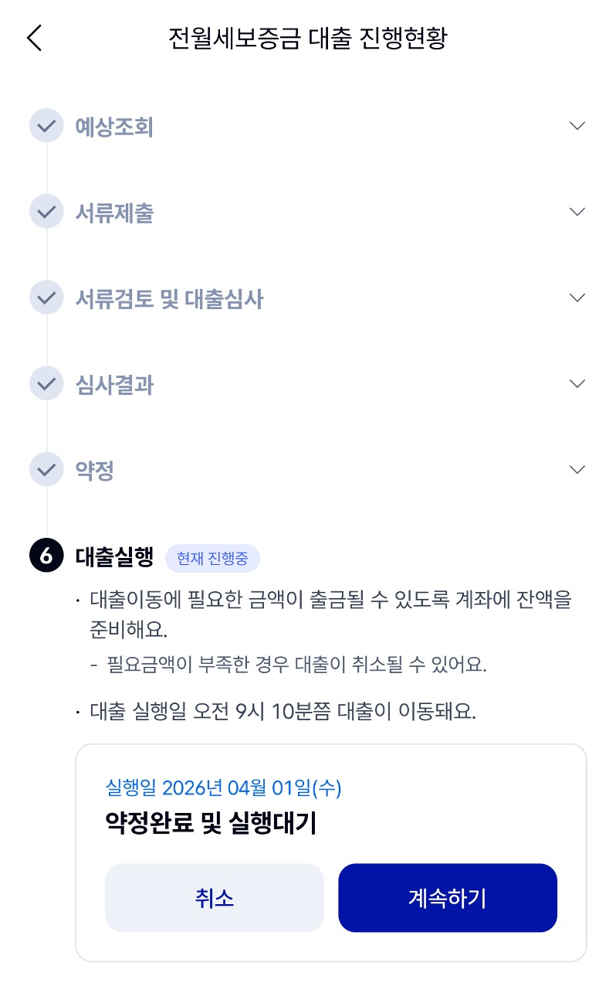
 

약정 완료 후 대출 실행을 기다리는 화면

 

실제 대출 실행 결과와 최종 적용금리는 실행일에 다시 확인해야 합니다.

 
 
 

## 마치며

 

처음에는 전세대출을 갱신하는 과정이 복잡할 것 같았습니다. 하지만 예상 조회부터 서류 제출, 심사, 약정까지 앱에서 진행 상태를 확인할 수 있어 흐름을 따라가는 데 큰 어려움은 없었습니다.

 

 

<a href="https://portal.kfb.or.kr/fingoods/cofix.php">은행연합회 COFIX 통계</a>

 

다만 6개월 변동금리 상품인 만큼 다음 금리 갱신은 계속 확인해야 합니다. 신청 당시와 비교해 코픽스 금리가 올랐기 때문에, 다음 갱신 때 최종 금리가 얼마나 달라질지는 조금 걱정됩니다.

 

전세대출 갈아타기를 고민하고 있다면 금리만 비교하기보다 기존 대출의 상환금액과 중도상환해약금, 실행일에 필요한 비용, 우대금리 조건을 함께 확인해 보시길 바랍니다. 저처럼 회사의 이자 지원 조건이 있다면 지원 대상 은행인지도 먼저 확인하는 편이 좋겠습니다.

 
 
 
