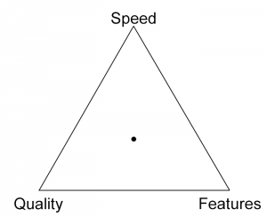
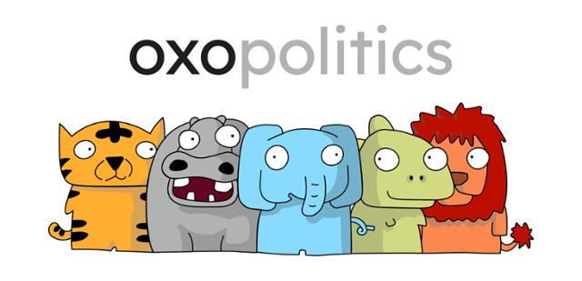
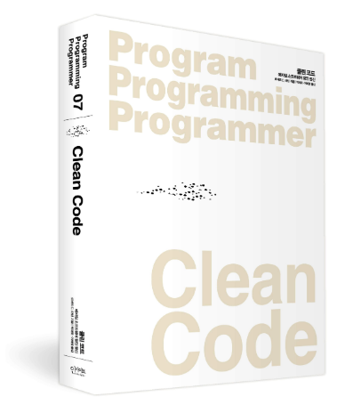

# [캐치 개발자 커리어콘] 개발자의 역량 키우기 

 
 
 

 

지난 04. 26(월) ~ 04. 30(금) 진행된 캐치 커리어콘 '개발자 역량 키우기'의 2주차 '개발자와 성장' 주제에 대한 메모입니다. 주최측인 캐치에서 강연을 정리하여 포스팅하는 것은 허용하나 강연 PPT를 그대로 사용하는 것은 허락을 받지 못하였기에 일부 강의자료에 사용된 사진은 외부 이미지로 갈음하였습니다.

 
 

# 나를 위해 일하는 개발자

 

## 강연자 소개

 

 

- 유호현
- '실리콘밸리를 그리다', '이기적 직원들이 만드는 최고의 회사' 저자
- 연대 인문학부 학/석사, 텍사스 정보학과 정보학과 박사과정
- 트위터(13-16년)
    - 영문과에서 영어 음성학을 공부했다. 언어 처리는 문정학과에서 배운 게 도움이 되었다.
    - 3년 일했다. 2년 자연어 처리 팀, 마지막은 검색팀
- Airbnb(16-19년)
    - 링크드인을 통해서 결제팀을 몰라도 되니 알려줄테니 입사해라
    - 마지막 1년 동안 새로운 사업을 진출 위해 집에서 에어비앤비 예약한 곳까지 가는 신 서비스 팀에서 일했다. 
    - 코로나로 인해 25% 정리해고가 되었고 당시 짤렸다. 
    - 실리콘 밸리에서는 회사에서 짤리는것이 좋다. 3-4년에 한번씩 옮기는데 자기발로 나가면 퇴직금이 0이다. 회사에서 잘리면 몇 달 치 월급을 준다.
    - 사이드 프로젝트로 안 싸우고 토론하는 플랫폼을 만들었다. 그게 사업이 되었다.
- 옥소폴리틱스 대표(20년-)

 
 

## 결정권이 어디에있는가? 

 

- 위계조직
    - 위계에 따라서 결정이 된다. 아래로 갈수록 결정권한이 떨어진다. 아래 직원은 시키는 일을 하는 것.
    - 아래 직원은 생각을 많이 하면 안 된다. 다음 주까지 하라고 일을 주면 반문하는 것이 아니라 일을 해내는 것
    - 사장님이 1,000개 팔자고했는데 실무진이 ~문제가 있어서 안 팔리는 데요? 다음 결정에 도움이 되도록 보고서 써서 사장님에게 전달한다.
- 역할 조직
    - 역할에 따라 결정권을 준다.
    - 디자이너가 어떤 디자인을 했는데 사장님이 별로라고 했다. 위계조직에서 사장님이 별로라고 하면 시장에 나가지 못한다. 그러나 역할 조직에서는 디자인 전문가가 결정한다.
    - 위계조직에서는 사장님 마음에 드는 일을 하는 사람이 최고의 직원이다. 그러나 역할 조직에서 디자인을 못 하는 사람이 디자인하면 이상한 디자인이 시장에 나간다.
    - 직원의 능력에 따라 시장에 나가는 퀄리티가 차이가 심하다.
    - 실리콘밸리에서 누굴 데려오냐에 따라 퀄리티 차이가 많이 나기 때문이다.
    - 매니저는 엔지니어보다 덜 전문가이다. 매니저는 엔지니에게 질문한다. 왜 이런 일을 하는지, 다른 디자이너, 다른 직군과 소통한다. 엔지니어가 종합적으로 판단한다. 앉아서 코드 짜는 시간보다 소통하는 시간이 더 많다.

 

- 우리나라에서 뛰어난 엔지니어를 데려와도 표준화하기 때문에 큰 의미가 없다.
- 역할 조직의 인재가 위계조직으로 가면? 기획서를 보고 '왜 Java로 구현하나요?', '왜 구글 클라우드를 안 쓰는지?' 등등의 질문을 하면 팀장님은 사장님 결제 났기에 기획서대로 해오라고 한다. 역활조직의 인재의 강점은 종합적인 소통능력과 판단력인데 위계조직으로 오면 말만 많은 사람이 된다. 
- 위계 조직에서는 승진이 제일 좋은 일이다. 우리 팀장님이 나에게 무엇을 원할지? 과장님이 원하는 일을 잘해내서 안 짤리는 것이 중요하다. 위에서 20년 전 기술을 써서 하자고 하면 잘 하면 된다.
- 역할 조직에서는 2~3년에 한 번씩 이직한다. 이 회사에서 승진이 그렇게 중요하지 않다. 이 회사에서 짤리는 것은 심각한 문제가 아니다. 제일 문제는 3년 뒤 이직을 하려고 하는데 아무 곳도 나를 찾지 않는 것이 문제인 것이다. 즉, 다른 회사가 나를 찾는 사람인지, 업계가 나에게 원하는 것이 무엇인지가 중요하다. 마치 프로 축구 선수 같은 것이다. 손흥민이 레알 마드리드에서 오라고 하고 여기저기에서 오라고 하는 것이 중요한 것이다. 팀에서 방출되었는데 갈 데가 아무 곳도 없는 것이 제일 문제다. 
- Airbnb에서 중요한 것은 업계 최신 기술을 알고 있고, 오픈소스에 컨트리뷰션을 하는 것이다. 그러면 다른 회사에서 뽑아가려고 한 것이다. 항상 혁신적인 것을 해야 한다. 
- Airbnb에서 떠날 때 어떤 사람이 되려고 하는지 물어봤다. 백엔드 엔지니어인데 프론트도 하고 싶다고 했다. 매니저가 프론트 일을 줄까? 했다. 당시 아는게 아무것도 없어서 오래 걸린다고 하였으나 기다려준다고 했다. 처음에는 매니저가 착한 것으로 생각했다. 나중에 알고 보니 회사가 원하는 것과 내가 원하는 것을 일치하면 관리하지 않아도 된다. 내가 프론트 공부하고 싶은데 벡엔드 일을 하면 회사에서 벡엔드 일을 하지만 집에 가서 프론트 공부를 할 것이다. 회사 입장에서 마음은 프론트에 가 있는데 회사에서 억지로 벡엔드 일을 하는 것이 된다. 회사에서 내가 프론트 일을 하지 않나 감시해야 한다. 

 
 

A. 내가 하고 싶은 것 = 회사가 하고 싶은 것
B. 내가 하고 싶은 것 x 회사가 하고 싶은 것
C. 내가 하고 싶은 것이 없음

 

- 실리콘밸리에서 제일 골치 아픈 인재상이 회사에서 시키는 거 하고 돈 주는 대로 일하겠다는 사람이다. 동기부여 시키기가 어렵다. 이 사람에게 당근을 제공하던가 채찍을 제공하던가. 당근보다 채찍이 비용이 적게 드니 '너 이거 안 하면 잘려' 식이 된다.
- 역할 조직에서는 A가 제일 좋고, C가 제일 안 좋다.
- 위계조직에서는 C가 제일 좋다. 자기가 하고 싶은 것이 있으면 안 좋다. 딴짓하지 않나 감시해야 한다. 

 
 

역할조직 x 수평조직
역할조직 x 반영조직

 

- 시니어 엔지니어가 주니어 엔지니어보다 책임이 크다. 주니어 엔지니어는 작은 책임을 갖고 있다. 
- 전문가가 각자 조직에 맞게 판단하는 것이다. 

 
 

## 일과 행복

 

 - 한국에 있을 때는 행복하다는 말이 이상한 말이다. 엄살을 떨어야 한다.
 - 실리콘밸리에서 매니저에게 너무 힘들다, 나 불행하다고 하면 매니저가 난리 난다. 내가 최고의 퍼포먼스를 낼 수 있도록 도움을 주는 것이 매니저이다.

 
 

## 매슬로우 욕구 5단계

 

 

Source <a href="https://ko.wikipedia.org/wiki/%EB%A7%A4%EC%8A%AC%EB%A1%9C%EC%9D%98_%EC%9A%95%EA%B5%AC%EB%8B%A8%EA%B3%84%EC%84%A4"> Wiki. 매슬로의 욕구단계설 </a>

 

 - 내가 싫어하는 일을 해야 하면 불행한 것이다.
 - 회사에서 불행한 것은 당연하다.
 - 직원들이 신나서 일하고, 커리어의 성공을 위해서 일해야 회사에 도움이 된다. 
 - 손흥민에게 몇 골 이상을 넣으라고 하면 얼마나 스트레스를 받는가? 팀에서 골을 많이 넣으라고 압력을 넣은 것이 아니라 세계적인 축구선수가 되기 위해서이다. 동기부여가 스스로 나오니 열심히 하는 것이다. 
 - 엔지니어에게 몇 주까지 해오라고 하는 것이 아닌 당신이 생각하는 방법으로 해보라고 하면 스스로 동기부여가 되며 공부하고, 개선할 것이다.

 
 

 - 실리콘밸리에서는 엔지니어에게 '하나를 가르쳐주면 하나만 알아라'라고 한다.
 - 실리콘밸리는 멀티 컬쳐이다. 한국식으로 척하면 척해라. 그건 안된다. 오버커뮤니케이션 해야 한다. 그것 때문에 명확하게 되어 빠르게 나가는 것이다. 
 - Bus factor
    - 멋진 코드를 만들었는데 아무에게 어떻게 돌아가는지 알려주지 않았다. 그 다음 날 버스에 깔려서 병원에 갔다. 회사에서는 그 프로그램이 어떻게 돌아가는지 아는 사람이 아무도 없다. 지식이 없어진 것이다. 만든 날에 옆에 있는 친구에게 알려주면 Bus factor가 2가 된다. 두 명까지 버스에 깔려 죽어야 정보가 사라진다. 문서로 남기면 Bus factor가 무한대이다.
    - Bus factor는 좀 무서운 말이니 lotto factor, 즉 몇 명까지 로또에 당첨되어 회사에 나오지 않더라도 괜찮은가? 라는 표현도 있다.
- Postmortem(포스트 모템)
    - 죽었는데 왜 죽었는지 부검하는 것이다. 
    - air bnb 결제팀에서 일하는 당시 버그가 생겨 2000만원 정도 날아갔다. 여러 사람의 계좌에 돈이 들어갔다. 2시간 후에 발견해서 코드를 revert했다. 밤새 나 죽었다고, 어떻게 책임을 져야 하는지 슬퍼했다. 매니저가 포스트 모템하자고 했다. 언제 어떤 일이 있었고, 어떻게 버그를 생기지 않게 할지. 전송 버튼 옆에 이 메일을 보내면 전 직원에 간다고 쓰여있었다. 전 직원에게 2만 불을 날렸다는 메시지가 가는 것이다. 그러면 승진도 안되고, 별명이 이만 불일 될 수 있고, 무서운 상황이 될 수 있다. 그런데 메일을 보내고 나니 사람들에게 고맙다는 메일을 받았다. 놀리는 것이 아니라 이전에 이런 일이 여러 번 있었는데 책임을 지고 포스트 모템을 작성해서 재발 방지 대책을 만들었으니 그것이 고맙다는 것이다. 책임을 진다는 것이 2만 불을 메꾸는 것이 아니라 실수했다는 것을 인정하고 시스템적으로 재발하지 않기 위해서 만드는 것이다. 
    - 포스트 모템을 안 하는 회사는 언제 어떤 방식으로 지뢰를 밟을지 모르기 때문에 개발자가 소극적이게 된다.

 
 

## 실리콘벨리의 의사결정

 

- 위계조직에서는 결정권자가 큰 사람이 결정
- 실리콘밸리에서는 각 주체가 의사 결정하는데 처음에는 싸움이 잦을 줄 알았다. 그러나 정반합으로 좋은 방향으로 간다. 
- 이 부분이 좋아서 한국 기업에 소개하기 위해서 책을 썼다.
- 국가에 좋은 의사결정 방법을 적용해보자는 생각으로 옥소폴리틱스 스타트업을 시작했다. 
    - 데이터로 의견을 클러스팅해서 부족을 만들었다.
- 역할 조직을 꼭 따라야 하는 것은 아니다. 더 진화된 방법이 있을 수 있다. 

 
 

## 소통의 비용을 낮추가

 

- 대표의 시간을 아끼려고 직원들이 수 시간을 정리해서 장표를 정리해서 알려준다. 대표 시간을 아끼려고 하는 게 아니라 계속 이야기 하는 방법을 선택했다. 
- 소통의 비용을 낮추어서 쉽게 이야기하고 쉽게 무시하고, 직원들도 내 말을 쉽게 무시할 수 있는 문화를 만들었다. 

 

Source. <a href="https://www.brandonsavage.net/the-software-dilemma/"> The Software Dilemma </a>

 

- 위계조직에서 기획은 Quality, Features를 정의해준다. 그렇기에 Speed가 좋은 직원이 칭찬받는다. 
- 실리콘밸리에서는 이 균형을 잘 맞추는 것이 중요하다. 

 
 

## Q&A

 

- 커리어 발전이란?
    - 스토리를 만들어라. 만들고 싶은 프로덕트는 이런 것. 나는 당신 회사에 이런 것을 만들 수 있다. 트위터가 필요한 한국어 자연어 프로그램을 만들어줄 수 있어요. 나를 셀링하라.
- 실리콘 밸리 문화는 지금도 이런가요?
    - 역할 조직을 추구하는 조직은 실리콘밸리에 없다. 
    - 모든 회사가 자기 문화를 다양하게 갖고 시작한다. 실리콘밸리 회사들도 다양하게 문화를 갖고 시작한다. 그중에 누가 좋은 문화인지는 모른다. 여러 회사의 공통점을 모아보니 전문가 집단의 동기를 잘 활용하는 회사가 살아남다. 전문가들에게 역할을 주어야한다라의 개념이 구글 넷플릭스 등 다양한 회사에 문화로 남아있다. 
- 위계 조직인지 역할 조직인지 입사 전에 구분하는 방법?
    - 회사가 미션이 있는지.
    - 세계 1위 자동차를 만드는 회사라면 이 미션은 들으나 마나한 미션이다. 대부분 회사가 1위가 되고 싶어한다. 여기서는 설계하고 만들고의 반복
    - 인류의 이동을 편하게 하자. 1년 차에는 스케이트보드도 만들어보고 오토바이도 만들어보고 다양할 것이다. 이 회사가 1위가 되더라도 비행기, 우주선 등등 만들 것이다. 이런 회사는 에자일 하기에 역활조직이 될 수 없다.
- 프로그래밍 독학을 어떻게 했는지?
    - 데이터구조, 알고리즘 등등 코세라에서 강의들었다.
    - 프로그래밍이 좋아서 하다 보니 엔지니어가 되었다. 
- 면접 잘 보는 법?
    - 이런 거 필요하시죠? 이게 만점이다. '내가 가지고 있는 기술을 적용해서 이렇게 할 수 있다.' 이렇게 말할 수 있으면 베스트이다.
- 해외도 SI업체, 서비스 업체 나누어져 있는가?
    - 해외도 SI 업체가 있다. 어쨌든 SI 업체의 엔지니어는 수동적으로 사고 안치려고한다. 
    - SI에자일 개발도 있다. 전부 만드는 것을 계약하는 것이 아닌, 언제까지 ~만큼 개발할게
- 좋은 개발자란?
    - 내가 무엇을 잘하는지 무엇을 못하는지 알고, 나의 장점으로 전체 프로덕트에 어떻게 기여할 수 있는지 아는 사람
- 협업을 잘하는 사람이란?
    - 약속을 지키는 사람
    - 우리에게 이런 프로젝트가 있는데 당신에게 얼마나 끝날 수 있는지 물어본다. 여기서 두 주가 걸린다. 한 달이 걸린다. 할 수 있지만 일단 말한 시간을 지켜야 한다.
    - 한 달 후에 엔지니어가 개발이 끝난다는 약속을 믿고 마케팅 부서가 한 달 후 마케팅할 준비를 했는데 기능 추가 안 됐다고 하면 마케팅은 망하는 것이다.

 
 

 

*강연자님의 요청에 따라 운영하시는 스타트업 옥소폴리틱스 소개합니다. 옥소폴리틱스는 최초의 정지 스타트업으로 발전하는 사회가 되기 위해 다양성을 존중한 의견을 공유하는 의견토론의 장입니다. 의견에 대한 데이터 시각화, 동물 부족과 같은 여러 요소가 있습니다. [참고. 국내 최초 정치 스타트업 옥소폴리틱스](https://www.hankookilbo.com/News/Read/A2021010415450000191)

 
 
 
 

# 엔지니어로서 성장을 이끌어준 순간들

 

- 강연자 강진우
    - 당근마켓 DevOps
    - 전. NBP(09-12), 카카오(12-19), 리버스컴퍼니(19-21)
    - 도서: 리눅스 커널 이야기 

 
 

## 스터디

 

- 시간이 지나면서 업무에 익숙해지면서 새로운 것을 해야 하는 순간에 해내지 못했다. 
- 성장이 멈춘 것을 느끼고 어떻게 해야 잘할 수 있을지를 고민
- 멈춘 성장에 대한 돌파구로 커널 스터디를 시작. 그동안 실무에서 부분적으로 알던 지식이 스터디를 통해서 연결되는 시간이 됨
- 기술을 용도에 맞게 활용하기 위해서는 내부구조에 대한 이해가 필요하다는 것을 느낌.
    - TIME_WAIT 소켓이 서비스에 어떤 문제를 일으키는지 알고 있는가? 다양한 커널 파라미터로 해결하는 글이 있다. 그러나 왜 문제이고 왜 생기는지 이해가 있어야 제대로 된 대응을 할 수 있다.
- 기술을 어떻게 활용할지 바로 알기 위해서 공식문서, 다이어그램을 먼저 본다.

 
 

## 글 쓰기

 

- 엔지니어에게 글쓰기는 너무 중요하다.
- 커널 스터디를 통해 기존과 다른 시각을 얻게 되고, 회사 내부에서 인정받는 엔지니어로 성장한 순간에 지식을 정리하고 나누고 싶다는 생각이 듬.
- 카카오에서 브런치 서비스를 사내 오픈 베타를 시작했다. 
- 사내 작가로 운 좋게 선정되어 업무하며 배운 것들을 정리하기 시작했다.
- 작성한 글을 페이스북으로 나누었다. 겸손의 미덕으로 공유하는 것을 주저하는 사람이 있다. 그러나 자신이 알고 있는 것을 나누고, 잘못된 내용은 피드백을 받아 수정하는 것. 글 쓴 사람, 글 읽는 사람 함께 성장하는 기회이다.
- 페이스북 글을 보고 출판사 사장님이 연락을 주었다. 이를 계기로 '리눅스 커널 이야기'책이다.
- 책을 쓰는 과정은 너무 힘들지만, 그 열매는 달다!

 
 

## 컴포트 존

 

- 바닷가재가 성장하는 법. 껍질을 버리고 새로운 껍질을 만들어 낸다. 우리가 성장하는 방법과 같다.
- 업무의 영역을 넓혀본다. 기존 시스템 엔지니어 업무 + ElasticSearch 클러스터 구축 업무
- 주어진 환경을 새롭게 바꾸어봄. 파이썬을 사용하지 않고 고랭으로 개발하기
- 이직을 통해 새로운 환경 경험. 새로운 사람, 새로운 장소, 새로운 업무

 
 

## 동료들

 

- 나를 믿어준 동료들이 없다면, 응원해주는 동료가 없다면 성장을 할 수 없을 것이다.
- 여러분도 누군가에게 힘이 되는 동료가 되어라.

 
 

## Q&A

 

- 개발 지식에 끝이 없다. 어디까지 공부해야 하는지? 깊이에 대한 기준이 있었는지?
    - 어디서 시작할지가 중요하다. 커널이라고 하면 엄청 크고 내부 구조에 내부구조 .. 깊게 있다.
    - 시작하기 좋은 부분은 커널 파라미터이다. 커널 소스코드를 고칠 분도 있지만 잘 만들어진 커널 소스틀 사용하는 입장이다. 운영 상황에 맞게 최적화하는 것.
    - 커널 파라미터 도큐먼트가 다 맞지 않는다. 그렇기에 코드를 받아서 해당 부분을 보는 것을 시작으로 접근하면 된다.
- Dev Ops 엔지니어가 되기 위해서 어떤 것을 준비해야하는지?
    - 처음부터 Dev Ops가 아니라 시스템 엔지니어였다. 이직하면서 Dev Ops로 전환
    - 시스템 엔지니어는 물리 서버, 장비가 있었다면 Dev Ops는 클라우드 상에서 돌아가는 인프라를 구축하고 운영하는 업무이다. 
    - 개발은 당연히 할 줄 알아야 하며 문제 해결을 끝까지 해야 하는 집착이 었어야한다. 왜 장애가 나고 어디서 문제가 생긴 지 파악하여 똑같은 장애가 나지 않도록 파악해야 한다.
- 카카오, 네이버의 개발문화?
    - NBP는 연차가 적었을 때 있었다. 대리가 되고 얼마 뒤에 이직해서 문화를 느끼지 못했다. 인프라에 있기에 팀바팀이다. 
    - 두 회사 모두 엔지니어의 자율성을 인정해준다.
    - 이직 당시 카카오가 큰 회사가 아니라 왜 NBP에서 가냐고 말을 많이 들었다. 당시 카카오 엔지니어 5명이었다. 카카오는 신생 기업과 마찬가지였지만 성장하는 회사였다.
- 회사에서 성장방법
    - 내가 하고 싶은 것과 회사에서 해야 하는 것을 일치하는 게 중요하다. 그 일을 통해서 성장하는 것.
    - 이를 위해서 팀장님과 끊임 없이 이야기하는 것이 중요하다. 대화하지 않으면 맞출 수 없다.
- 커리어 관리?
    - 도전하면 커리어가 꼬일 수 있지만, 자신의 자신이 된다. 완벽한 선택은 없다.
- 이직할 때 어떤 생각으로?
    - 카카오는 생긴지 얼마 안 되어서 잘할 수 있을지 모르겠지만 NBP보다 훨씬 많은 것을 할 수 있을 기회가 있을 거라고 생각.
    - 네이버, 카카오에서 10년 일을 했는데 저 자신에게 성장이 멈추었다고 생각이 들었다. 클라우드 붐으로 스타트업이 많이 생겼을 때 도전하고 싶었다. 추운 겨울 스타트업으로 가고 싶었다. 클라우드 경험이 없어서 스타트업으로 이직.
    - 당근마켓도 성장단계에 있기에 많은 것을 해볼 기대로 이직함
- 이직이 답인지? 기존 회사에서 할 수 있는 게 없는지?
    - 성장이라는 것은 결과적으로 내가 해내야하는 것. 
    - 현재 회사에서 스터디를 통해서 같은 다양한 기회로 나는 이렇게하면 잘 성장할 수 있는지 찾아야한다. 사람마다 선호하는 방식이 다르다. 
    - 모든게 어려우면 글을 쓰는 것이다. 
- 개발을 공부하는 노하우
    - 일단 해보는 것. 구체적인 목표를 잡고 공부하는 것.
    - 책을 보고 따라가는 것은 재미가 없다. 일단 해보고 책을 보면 내가 이래서 삽질했구나. 
- 대기업에서의 개발의 장단점, 소규모 기업에서 개발의 장단점?
    - 대기업
        - 장점: 사내 표준이 촘촘하게 되어있다. 안전장치가 많이 되어있다. 좋은 설계에 대한 자료가 많다. 
        - 단점: 전체 서비스에서 작은 부분을 맡게 된다. 이런 부분에 답답함을 느낄 수 있다.
    - 스타트업
        - 장점: 본인이 해야할 업무가 많다. A-Z까지 본인이 해야 하기에 경험이 많이 쌓인다. 
        - 단점: 일이 많기에 힘들다. 
    - 초반에는 대기업에서 탄탄하게 교육받아 인사이트를 충분히 얻고, 5년차, 10년차 되었을 때 스타트업 세계로 나와 멋지게 해봐라.
- 좋은 회사를 고르는 기준? 
    - 폐쇠적인 개발자의 성향이 있다. 서비스가 잘되는데 건드려서 장애가 생기지 않았으면 좋겠다. 
    - 신기술을 부어 넣는 분화를 선택하는 분야가있다. 본인 성향에 맞는 회사를 찾아라.
- 요즘 개발자들의 연봉이 화두가 되고 있다. 연봉에 대한 생각은?
    - 연봉은 잘 받아야 한다. 일 많이 배울 수 있는데 연봉이 낮으면 안된다. 본인의 노력에 대한 정당한 대우를 받아야 한다. 

 
 

# 소프트웨어 장인정신, 클린코드

 

 

- 박재호: 클린코드 번역

 

## 클린코드가 사랑받는 이유

 

- 클린코드는 08년 8월 출간 대부분 기술서의 경우 10년이 지나면 가치가 떨어진다.
- 클린코드는 다음 주제와 엮여 있으며 코드 기반을 튼튼하게 다진다.
    - 리펙터링: 백지가 아닌 누군가 만든 코드를 기반으로 개발한다. 어떻게 이를 개선할지가 중요하다.
    - 기술 부채: 부채는 우리가 발전하는 과정에서 래버리지로 사용할 수 있는 도구이다. 
    - TDD: 모든 함수는 TDD로 만들 수 없다. 인명, 금전적인 손해가 예상되는 경우 TDD로 개발해야 한다.

 
 

## 읽기 좋은 코드의 중요성

 

- 코드 읽기 vs 코드 쓰기 = 10 : 1 비율이다. 코드 쓰는 시간보다 읽는 시간이 많다.
- 주변 코드를 읽지 않으면 새 코드를 짜지 못한다.
- 급하다면 읽기 쉽게 만들어야 한다. 
- 과거에 잠깐 편하자고, 이 정도면 되었지 느슨하게 생각한 부분이 미래의 나에게 영향을 미친다.
- 코드의 가장 먼저 읽을 사람이 내가 될 가능성이 크다. 

 
 

## 지속적인 개선의 중요성

 

- 좋은 코드를 한번 만들면 끝난다고 생각할 수 있다. 그러나 현실은 정반대이다.
- 데이비드 파나스
    - 70년 초반 모듈이 소프트웨어에 어떻게 나누어야 하는지 개념을 제시한 분이다. 
    - 이 분이 모듈화를 제시하기 전까지 물리적 단위로 나누었다. 
    - 모듈은 작업단위, 특정 개발자에게 맡길 수 있는 작업의 범위 즉 논리적인 단위를 제시했다. 
    - 아무 페이지 책의 코드를 한 번에 짜지 않았을 것이다. 
- 프로그래밍은 과학보다 공예에 가깝다. 
- 깨끗한 코드를 짜려면 지저분한 코드를 먼저 작성하라.
- 코드에 만족하는 프로그래머보다 더 심각하게 개발 프로젝트에 악영향을 미치는 요인은 없다.

 
 

## 보이스카우트 규칙

 

- 마이클 페더즈
    - Working Effectively with Legacy Code 저자.
    - '깨끗한 코드는 언제나 누군가 주의 깊게 짰다는 느낌을 준다. 고치려고 살펴봐도 딱히 손댈 곳이 없다. 작성자가 이미 모든 사항을 고려했으므로 고칠 궁리를 하다 보면 언제나 제자리로 돌아온다.'
    - 오픈소스를 분석할 때 내가 생각한 부분을 이미 다 해 구현해둔 부분이 있다. 이런 개발자가 되어라.
- 보이스카우트 규칙
    - 캠프장은 처음 왔을 때보다 더 깨끗하게 해 놓고 떠나라
    - 1년 전 코드보다 5분 전 코드가 정리하기 편하다.

 
 

## Q&A

 

- 마감 기간에 맞춰 개발하다 보면 클린코드를 지키기 쉽지 않다. 어떻게 하면 좋은가?
    - 클린코더라는 책에 '아니오'라고 말할 수 있는 개발자라는 표현이 있다. 보통 한 달 걸린다고 하면 이주 만에 하라고 일정 압축을 한다. 전문적인 개발자라면 그렇게 하면 안 된다고 말을 해야 한다. 
    - 여러 정황상 그렇게 말할 수 없다면 최선을 다하겠다고 말하고 커밋먼트 안 한다. 혹은, 약간 품질이 떨어지는 코드를 개발한다.  
    - 클린코드를 습관처럼 만들어라. 
- 기술 부채를 언제 상환해야 하는지? 결단하기 위한 시그널이 있을지?
    - 크게 한번 혼이나면 시그널이 생긴다.
    - 마이크로소프트는 기술부채를 상환하도록 시간을 주는 회사. 상환 시간이면 신규 기능을 넣지 못하게 한다. 출시일이 급해서 출시하고 정리할 시간을 주는 방식이다.
    - 경영진이 기술부채 청산하는 오더를 줄 수 있어도, 아래쪽에서 위로 제안하기는 힘들다.
    - 고객의 클레임, 신규 기능 추가해야 하는데 구조적으로 못하는 상황이 생기면 위험 신호다. 더 빨리갈수록 문제가 커진다.
- 개인적으로 클린코드를 위해 노력방법? 클린코드를 위한 좋은 개발문화에 대한 의견?
    - 아무리 악조건이더라도 개인이 바꿀 영역은 있다. 나 스스로 개선 포인트를 찾고 주변으로 전파하라. 그렇게 하기 위해서 개인이 스스로 뛰어난 개발자라는 것을 전파해야 한다. 잘못하면 주변에서 개발 못 해서 변명하는 게 아닌지 의심하는 상황이 생긴다.
    - 그렇다고 개인의 희생 영역을 말하는 것이 아니다. 개발자가 번아웃이 오면 답이 없다.
    - 개발문화는 규율과 자율을 조화롭게 만드는 것이 중요하다. 
    - 클린코드는 어떤 관점에서 규율이다. 읽기 조은 코드를 위해서 지켜야 할 규칙이 있다. 규율은 너무나 강력한 규율로 코드 경찰이라고 부르는데 코드를 보고 고쳐요 한다.
- 클린코드를 지키는 것이 좋다는 지표로 보이는 방법?
    - 소나큐브와 같은 툴이 있다. 룰에 의해서 코드의 상태를 보는 것이다. 코드의 중복 정도 등등
    - 잘 만들어진 오픈소스 초기 버전을 봐라.

 
 

# 경력직의 포트폴리오 준비법

 

- 구민정(풀스택 프리랜서)

 
 

## 신입이 아니라 경력을 선호하는 회사

 

- 경력을 선호하는 회사
    - 검증된 실력이 좋은 사람을 뽑고 싶어서
    - 조식의 성향이나 일하는 스타일이 맞는 사람을 뽑고 싶어서
    - 시간적 여유, 사수가 없기에
- 지원하고자 하는 회사 군에 맞추어서 설계
- 개발자 모임, 온라인 활동(오픈소스, 블로그) 많이 하라.
- 경력기술서가 서류의 70%, 그다음이 사이드 프로젝트

 
 

## 작성 요령

 

- 요약을 너무 많이 하지 마라.
- 기술 - 기능에 장점 혹은 특징을 얹어라.
- ex. 화면 개발 -> React 기반의 Web UI 개발 -> 재사용성을 위해 React 컴포넌트 디자인 시스템 개발. 웹 접근성, 웹 표준을 고려한 React 기반 UI 개발
- ex. Typescript, Webpack 사용 -> Typescript를 이용하여 Javascript 정적 타입 적용. 모듈 시스템 구축을 위해 Webpack 사용
- ELK 시스템 구축 및 운영 -> 대규모 분산 환경에서 ELK 기반 매트릭스 수집/분석 시스템 구축
- 회사들이 좋아하는 표현을 써라
    - 테스트코드, 안정적인 운영, 성능 최적화, 배포 자동화
    - 대용량, 분산처리, 오픈소스, 시스템 구축 / 운영
    - 서비스 운영, 트래픽, 모니터링
    - 생산성, 재사용성
    - 분석하여, 향상시키고, 최적화시키는
    - 추가로. 사용자 경험, 고객이 원하는, 의견을 수집하여 
    - ex. React로 컴포넌트 디자인 시스템을 도입하여 재사용성을 높임으로서, 업무 효율이 획기적으로 개선되는 경험을 했습니다. 
    - ex. Mock Server 도입, 프로젝트 기간 30% 이상 단축됨

 
 

## 개발자 포트폴리오 작성법

 

- 맨 처음에 자신을 지칭하는 맨트 넣는게 좋음. 인간미가 느껴지게
    - ex. IT 지식을 공부하고, 기록하고, 공유하며 동료들과 함께 성장하는 것을 지향합니다.
    - ex. 이슈 발생 시, 근본적인 원인을 파악하고 해결하는 것을 선호홥니다. 
    - ex. (경험형) 웹 페이지를 기획부터 배포/운영까지 경험해본 적이 있습니다.
    - ex. (노력 어필형) 개발 생산성을 높이기 위한 자동화 툴 활용에 관심이 많습니다.
    - ex. (개발 철학 어필형) 버그 최소화, 리팩토링을 고려하여 테스트 케이스를 꼼꼼히 작성합니다. 

 
 

## 포트폴리오 제작

 

- 노션, 깃허브, 웹사이트, PPT
    - 현재 70% 정도 노션으로 지원한다.
- 노션
    - 작성위 쉽고 필요한 내용을 많이 담을 수 있다.
    - 웹 링크로 제출하기에 제출 후 수정 가능하다.
- 강연자님의 공유 링크 자료
    - [개발자 노션 포트폴리오 모음](https://www.notion.so/e96d65744cf54a2f9fe488057a504bef)
    - [웹 사이트 포트폴리오 예시](https://github.com/congchu/jeongkoo-porfolio)
- Tip
    - miri canvas 활용
    - 아이폰 디자인 목업 등의 키워드로 검색
    - README에 video to gif 서비스를 이용하여 프로젝트 보여주기

 
 

# SW개발자의 좋은 학습방법

 

- 김정(코드스쿼드 대표)

 
 

## 걸어가는 속력과 방향을 인지하자

 

- 몰입, 속도 조절, 책임감 
- 자신의 학습 속도를 인지하라.
- 익숙한 방식보다 낯선 방식으로 도전하라.
- 의도적 수련 vs 반복 수련
    - 양치질을 20년 넘게 하지만 모두 양치질 고수인가? 아니다.
    - 성장을 위해서  개선의지(더 양치질을 잘하고 싶은 욕구), 구체적인 피드백(치과 선생님이 이를 양치질 잘못해서 뽑아야 해요), 적절한 시점에 피드백을 받아야 한다.
- 낯선 학습환경 + 다양성
    - 지식 x 연습 x 습관 x 인지 x 사회적 비용
    - 누군가 너 잘하고 있어 말해주어야 알 수 있다.

 
 

## 개구리를 해부하지 말고 직접 만들어라

 

- 개구리와 똑같이 만들려고 하면 이해하기 쉬워진다.
- 엔지니어는 시스템을 만드는 일을 한다. 계속해서 만들기 좋은 환경에 있다. 
- 학습하는 것은 뇌를 피곤하게 만드는 일이다. 
- 자존심을 버리고 자존감을 키우는 쪽으로 학습하라. 누군가와 비교하며 공부하지 마라. 나 빼고 잘한다고 생각하지 마라.
- 나 같은 사람은 그저 잠들기 전에 한 장의 그림만 더 그리면 된다. 해 지기 전에 딱 한 걸음만 더 걷다 보면 어느 날 나 자신이 바라던 모습과 만나게 될 것이다. 그것이 정사이든, 산 중턱이든 내가 원하는 것은 내가 바라던 만큼만 있으면 되는 것이다. (만화가 이현세)
- SMART 목표 매주 만들고 성취하기
    - 구체적(S), 측정 가능(M), 성취 가능(A), 관련된(R), 시간제한(T)

 
 

## 개발 과정 전체를 보는 시야

 

- 논리적인 판단, 추론, 분류, 설득, 전달 과정을 포함
- 분석, 설계 개발, 테스트, 배포 흐름을 이해
- 코드 리뷰 과정에서 공유와 의사 전달
- 작업 분배를 위한 이슈 관리 
- 팀 내외 협업 + 소통 과정
- 짝 프로그래밍을 해봐라

 
 

## 실수를 반복하면 적어도 하나를 개선하자

 

- 마이클 프레제
    - 모두 살면서 실수를 한다. 그 실수를 안 하려고 하면 실수를 감추려고 한다. 실수가 드러나는 환경을 만들어 실수를 예방할 수 있는 환경을 만들자.
- XEROX 연구소에서 일 잘하는 사람들을 분석
    - A라는 반복적인 일에 개선 작업을 넣는다. 진짜 일 잘하는 일은 일을 잘하기 위한 방법 또한 개선한다.
- 다양한 개선 방법들
    - 버전 관리를 위한 도구와 관리 방식
    - 코드를 작성하기 위한 고민 기록

 
 

## 스스로 여러 답을 찾고 공유하라.

 

- 현실에서는 수많은 정답이 존재한다. 
- 엔지니어는 여러 답 중에서 지금 상황에 맞는 것을 하나 고르는 것이다.
- 점진적 개선, 피어 리뷰, 공유 문화를 사용하는 게 좋다.

 
 

## Q&A

 

- 컴퓨터 공학이 유명해지고 있다. 많은 분이 개발자가 되려고 한다. 전망은?
    - 좋았다 나빴다 하는 시기가 있다. 코로나시국을 맞아 더 가속화되는 것으로 보인다.
- 적성에 맞는 개발자는?
    - 문제 해결하기 위해 몰입해서 접근하는 사람
- 계속 성장하는 개발자가 되기 위해 무엇을 하는 게 좋을까?
    - 개발자가 된 것이 끝이 아니다. 
    - 회사에 주어지는 일만 하면 신기술 접하기 어렵다.
    - 사이드프로젝트를 하면서 신기술에 도전해야 한다.
- 직장을 다니면 내가 잘하고 있는지? 평생 할 수 있는지? 이런 고민을 해결하기 위한 조언은?
    - 누구나 성장, 잘하고 있는지 인정받고 싶어한다.
    - 커뮤니티에 가서 같은 관심사를 갖는 사람들이 모여 소속감, 인정을 받는 게 중요하다.
    - 무조컨 커뮤니티로 뛰쳐 가는 것이 아닌 회사 안에서 그런 환경을 만드는 것이 중요하다. 내가 하고 싶은 것에 대해서 어필하는 것도 중요.
    - 내가 무엇을 할 수 있는지 환경이 좋은 회사이다. 복지는 일정 수준이 넘어가면 기하급수적으로 행복하지는 않다. 도전적인 업무, 이에 대한 인정으로 행복감을 높일 수 있다.
- 아직 시기는 언제일까?
    - 연차가 낮을 떄는 일 잘하는 환경을 만들 수 있다면. 현재 챌린지해서 개선하는 것도 중요
    - 이직하려는 회사가 반드시 좋은 것은 아니다. 생각을 잘해야 한다.
    - 10년이면 분야를 바꾸는 것도 좋다. 본인의 주기에 맞추어서 본인이 재미있는 것을 찾아라.
- 스타트업과 대기업 중에 어떤 회사를 갈까?
    - 성향에 따라.
    - 스타트업에 가면 여러 업무를 해야 한다. 앱 개발자가 벡엔드도 해야 하는 일이 생긴다.
    - 대기업 안에서 조직이 움직이는 것을 보고 싶다. 
    - 대기업이라고 좋은 사수가 있어서 잘 배우는 것은 아니다. 팀마다, 환경마다 다 다르다.
- 개발자 부트캠프, 학원, 온라인 강의가 많은데 개발자가 부족하다고 한다. 공부할 환경은 늘어나는데 왜 개발자가 부족하다고 하는가?
    - 부족하다고 하는 말은 10년은 되었다.
    - 대학 전공 과목이 크게 바뀌지 않는데 회사에서는 분야가 세분화되어있고 기술적인 성숙도가 높아지니 많은 기술을 학습해서 서비스를 만들 사람을 원한다.
    - 교육 업체가 대학과 현업의 사이를 메꾸고 있는 것이다.

 
 
 

# 어떤 개발자가 되고 싶나요?

 

- 이동규(우아한형제들 테크코스 코치)
- 회사를 자랑하는 사람이 아닌 회사가 자랑하는 사람이 되고 싶다.
    - 벌거벗은 힘. 회사에 속하지 않고 어디에 떨어져도 자립적으로 일어나는 힘 

 
 

## 사이드 프로젝트

 

- 사이드 프로젝트 하며 발생하는 문제를 해결하는 방법으로 학습
- 컴퓨터 공학이 아닌 경우 접근하기 좋은 방법이다.
- 사이드프로덕트의 가치보다 문제 해결을 위해 접근하는 방식이 중요하다. 고민을 포스팅하는 것이다.
- 제대로 된 한 프로젝트라도 있는 것이 좋다.
- 예시 프로젝트: [milzipmoza-developers](https://github.com/milzipmoza-developers/tecobrary-api)

 
 

## 학습에 대해

 

- 학습 주도권을 가져와라. 자신이 로드맵을 만들어서 하나씩 공부 참고. [woowacourse 로드맵](https://github.com/woowacourse/back-end-roadmap)
- CS를 물어보는 이유?
    - 문제 해결 역량을 확인하고 싶어서.
    - 새로운 문제를 해결하기 위해서 기본기가 탄탄해야 학습하고 적용하기 수월하다.

 
 

## 야크쉐이빙을 피하기 위해서

 

- 일단 문제를 해결
- 같은 문제가 발생하는 경우 동작 원리를 파악
- 면접에서 물어볼 만한 주제라면 나만의 용어로 정리

 
 

## 파인만 학습법

 

- [1] 배운 것을 종이에 적는다.
- [2] 그것을 간단하게 설명해본다. 막히는 부분을 설명해본다. 
- [3] 다시 공부한다. 설명을 최대한 단순화한다.

 
 

## 개발자 커뮤니티

 

- 자사 기술 지원 커뮤니티: AWS KRUG, GCP KRUG, Elasticsearch KRUG
- 기업 관리 커뮤니티: Facebook Developer Circle, GDG Korea WebTech
- 특정 기술 기반 커뮤니티, KSGU(Spring), 스사모(Spark), React Korea, Vue.js Korea, DevOps Korea, 제플린과 친구들, 장고걸즈, OSXDEV
- 네트워킹: 모각코, 9XD, 코무, 여개모
- 스터디: SLiPP, 자바카페, 코드스피츠

 
 

## 좋은 개발문화

 

- '찐은 좋은 환경을 만나 좋은 개발자로 성장하는 사람이 아니야. 척박한 환경을 기름진 환경으로 바꿔버리는 사람이야' - 임백준
- 좋은 개발문화?
    - 문화: 성숙도가 높은 사람들이 함께 일했을 때 상호작용의 결과
    - 송파구에서 일을 더 잘하는 11가지 방법
- 생각하는 좋은 개발문화
    - Core Benefit
        - 서비스의 핵심가치를 모두 인지하고 있으며, 도메인 지식을 서로 공유하고 그 근간이 되는 기술 개발에 대해 능동적인 문화
        - 고객에게 만족을 주어야 한다. (by 소프트웨어 장인)
    - DevOps
        - 짧은 개발 주기와 장애 내성, 고품질의 코드를 위한 리뷰/테스트 등의 필요성을 공감하는 문화
        - 고품질의 코드를 위한 리뷰/테스트 등의 필요성을 공감하는 문화
    - Professional: 결과물에 대한 책임감과 일에 대한 자부심, 전문성 등을 서로 고취시킬 수 있는 문화

 
 

## Q&A

 

- Core Benefit, DevOps, Professional를 만족하는 스타트업을 충족하기 어려운 회사에게?
    - 네카라쿠베에도 세 가지를 충족하는 팀은 없을 수 있다. 이상을 추구하자는 것
    - 내가 함께 일했으면 좋을 환경을 생각해라.
- 코드 리뷰, 리팩터링 or 최대한 많은 프로젝트를 하는게 좋은지?
    - 둘다 장점이 있다. 선택하라면 전자가 좋다.
    - 본인 나름대로 좋은 코드에 대한 기준치가 있으면 함께하기 좋다.
    - 코드 퀄리티가 좋은건 알더라도 익숙하지 않으면 바쁘면 좋은 코드를 작성하기 힘들다.

 
 
 

# 커리어콘 참가 후기

 

본 강연을 통해서 좋은 개발 문화, 성장하는 방법을 들었다고 변화시킬 수 없는 주변에 대해서 불평하는 것은 현명하지 못합니다.

 

여러분이 개발한 코드가, 몸담았던 조직이 아름다운 곳으로 변화시키는 사람이 되길 응원하며 그리고 저 자신이 그런 사람이 되기를 다짐하며 본 강연에서 소개된 임백준님의 말을 마지막으로 글을 마칩니다.

 

> '찐은 좋은 환경을 만나 좋은 개발자로 성장하는 사람이 아니야. 척박한 환경을 기름진 환경으로 바꿔버리는 사람이야' - 임백준

 
 
 
