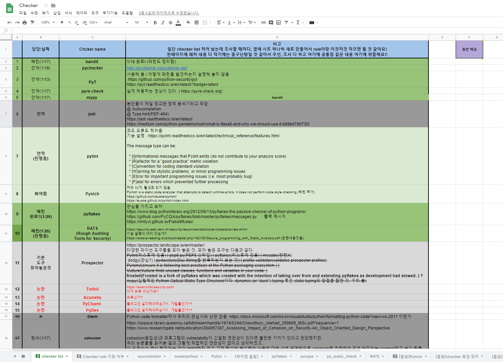
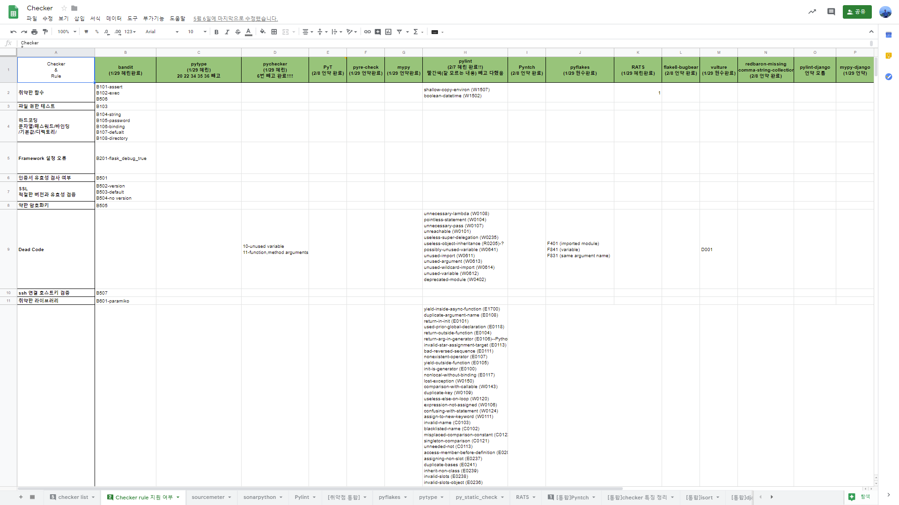
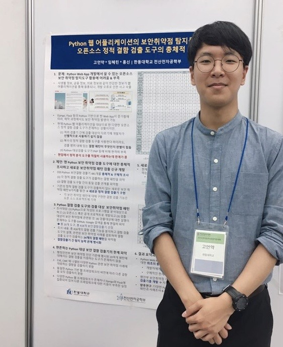
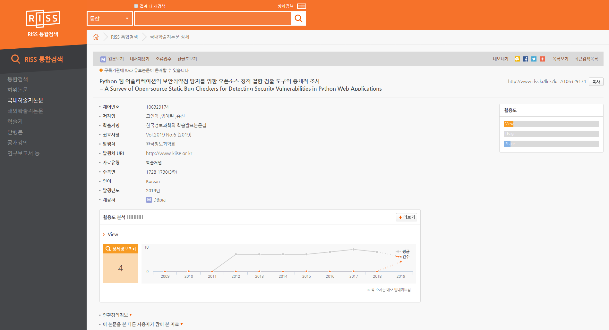

# KCC2019 학부생 논문경진대회에서 우수상을 수상하기까지

## [1] 글을 시작하며

- 대학으로 진학해서 전공을 선택해서 공부를 합니다. 저는 대학은 문자 그대로 큰 학문을 하는 곳이라고 생각하고 큰 학문을 하는 과정으로 인류의 학문적인 기여라고 생각합니다. 
- 학부생으로 KCC 논문 경진대회에 출전하고, 수상한다는 것은 쉬운 일이 아니었습니다. 연구의 시작부터 발표까지 일련의 과정을 거치면서 정리하고자 본 글을 씁니다.  

## [2] 주제 정하기

- 교수님의 오더로 시작했습니다.

## [3] 끝 없는 조사의 시작

> 정보의 태평양 인터넷에서 정적 분석도구를 조사하기 위한 삽질을 시작했습니다. 

### Step 1. 존재하는 오픈소스 정적 분석 도구 찾기 

> Google Sheet를 이용해서 협업했습니다.

- 처음에 검색했을 때는 Java와는 다르게 Python 정적 분석 분석 도구가 많이 검색되지 않아서 조사 분량이 적을것이라는 생각을 했습니다. 
- Github, python static analysis, python lint(er) 등등 다양한 검색어로 조사를 했습니다.   
- 그러나 조사하면 조사할수록 조금씩 조금씩 나왔습니다. 지구상에 존재하는 정적 분석 도구를 하나라도 놓치지 않기 위해서 구글 검색 결과 끝 페이지까지 다 봤습니다.  
- 마지막까지 조사를 한 결과 108개의 정적 분석 도구를 찾을 수 있었습니다. 
- 다만 취약성 검출과 다르게 mccabe(소프트웨어 복잡도 특정), pycodestyle(PEP8 적용 유무 검출)과 같이 우리의 관심사와 다른 정적 분석 도구가 있었습니다.
- 이를 걸러내기 위해서 READ.MD 정독, 관련 도구 명으로 검색을 통해서 걸러내었습니다. 위의 사진에서 비고란에 작성을 헀고, 녹색이 취약성 검출 도구입니다. 

### Step 2. 

> Checker별로 탐지하는 패턴을 정리하였습니다.

- READ.MD에 친절하게 본 Checker가 어떤 취약점을 탐지하는지 작성해 놓은 경우도 있었지만 큰 항목 하나 (예, SQL injection, XSS ...)를 탐지한다고 하는 경우도 있었습니다. 이 경우 클론한 다음에 검출 메시지 부분을 읽어서 어떤 부분을 검출하는지 파악하였습니다. 
- 이를 25가지 항목으로 분류했습니다. 분류는 OWASP와 행안부 개발보안 가이드의 47가지 항목 참고하였습니다. 

## [4] 한 편의 논문으로 

> 글을 쓴다는 것은 많은 에너지를 소비하게 됩니다.

- Step 1과 2를 진행하는데 방학 동안 2달의 시간이 지났습니다. 보통 오후 1시에 시작해서 새벽 1시까지 작업했습니다.
- KCC 논문 접수 마감이 얼마 남지 않은 상황이었습니다. 
- 시험기간이기도 했기에 파트너와 함께 카페에 가서 2시간 동안 70%의 글을 완성했습니다. 
- 책상에 오래 앉아있는다고 좋은 글이 나오지 않다는 것을 느꼈습니다. 평소에 자신이 어떤 연구를 하는지에 대한 명확한 이해와 타인에게 자신의 연구를 어떻게 전달할지 많은 생각을 할 수록 간결한 글과 명확하게 전달할 수 있다는 사실을 알게되었습니다.

## [5] 제주 IDC로  

- 당시 H사 에서 인턴중이었기에, 현장 실습생에게 주어지는 한 달에 1일 쉴 수 있는 휴가를 이용해서 6/27 ~ 28 1박 2일동안 제주 IDC로 발표하러 갔습니다. 

> 어벙...

- 28일 오전 포스터 발표시간에 발표했습니다. 다른 주제도 봤으면 좋겠었는데 많이 보지 못해서 아쉬웠습니다.
- 짧은 시간 다른 사람의 포스터를 보았습니다. 많은 이들의 노력과 열정을 볼 수 있는 시간이었습니다.
- 로비에서 했는데 진짜 더웠습니다...

## [6] 수상 발표

- KCC 홈페이지에서는 7월 말에 발표라고 하였으나, 8월 8일날 [KCC 홈페이지](http://kiise.or.kr/conference/kcc/2019/)에서 발표하였습니다.

## [7] Contribuiton
- 해당 주제로 학교에서 캡스톤상을 수상 받지 못하였습니다. 더구나 정적 분석이라는 주제를 캡스톤 당일 지인들에게 설명하기는 더더욱 어려웠습니다. 캡스톤 발표 바로 옆 팀이 로봇 탁구 주제로 많은 사람들이 방문한 팀이였기에 더더욱이 명과 암이 부각되었습니다. 
- 타인에게 인정받으려고 시작한 연구는 아니였지만 학문적 기여로 인정받을 수 있어서 감사하게 생각합니다.  

## [8] 총총

> RISS에서 확인할 수 있습니다. [(여기) - Python 웹 어플리케이션의 보안취약점 탐지를 위한 오픈소스 정적 결함 검출 도구의 총체적 조사 ](http://www.riss.kr/search/detail/DetailView.do?p_mat_type=1a0202e37d52c72d&control_no=a6ad7eeb5b6e185ec85d2949c297615a)

