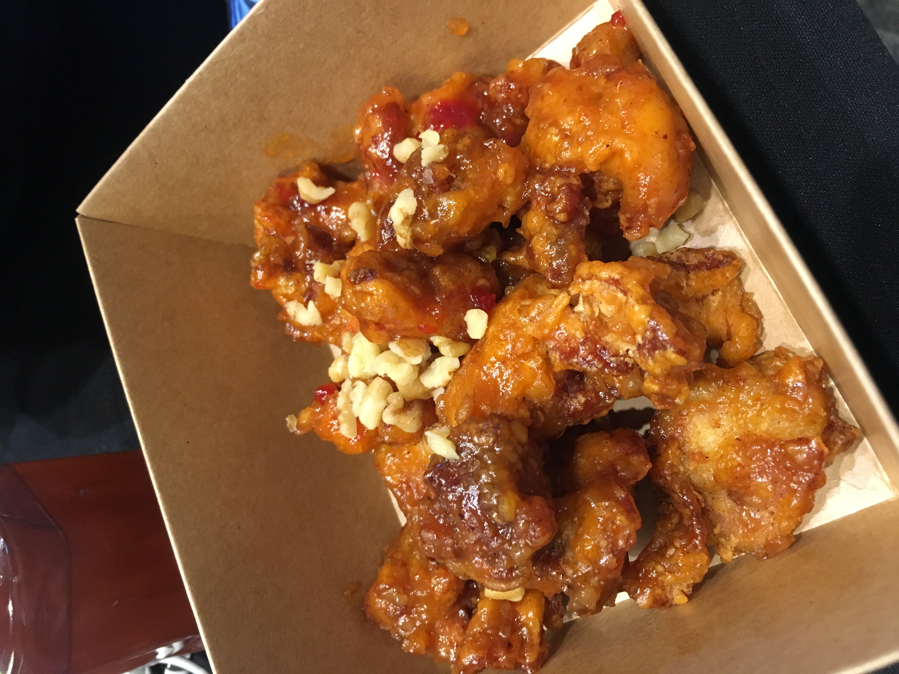

# 제 6회 개발보안 경진대회 수상 후기


<p style="text-align: center;">

</p>
<center> 대학생 신분으로 장관상을 탈 수 있는 어마어마한 기회! </center>

## [1] 대회 소개
- 미래의 SW 개발자인 대학생에게 ‘SW 개발보안’을 널리 알리고 활성화시키고자 행안부 주최로 본 대회가 열립니다.
- [소프트웨어 개발보안 가이드 - 행안부](https://www.mois.go.kr/frt/bbs/type001/commonSelectBoardArticle.do?bbsId=BBSMSTR_000000000015&nttId=57473)에서 내용을 확인할 수 있습니다.
- 5회 본선 진출하고 수상하지 못해서 복수의 칼날을 갈고 6회에 도전했습니다.


<p style="text-align: center;">

</p>
<center> 변한 개발보안 대회 (출처 - 개발보안 페이스북 페이지)  </center>


## [2] 기획서

 - 처음부터 난관이었습니다. 아무리 개발 보안 가이드에 대해서 잘 알고 있다고 하더라도 기획서가 통과되지 않으면 실력을 보여줄 수 없으니 아이디어를 잘 생각했어야 했습니다. 
 - 인터넷으로 확인할 수 있는 공공 해커톤으로 과거에 수상한 작품은 다 보았으며, [공공데이터 포털 활용사례](https://www.data.go.kr/useCase/exam/index.do;jsessionid=Lxjkleu59ADHBYD60Pim2+vi.node10)도 1페이지부터 끝 페이지까지 다 봤습니다. 
 - 다른 주제를 따라하는 것이 아닌 __공공을 위한, 사회 문제를 해결할 수 있는 서비스를 만들고 싶었습니다.__
 - 처음에는 법률쪽으로 편리한 공공 서비스를 개발하려고 했습니다. 다만 민감할 수 있는 주제여서 포기했습니다.
 - 군대 인트라넷의 연장선으로 전역한 사람들의 모임인 전우 커뮤니티를 만들려고 했으나 드랍.. 
 - 한국 사회의 문제인 저출산, 고령화를 해결할 수 있는 서비스를 만들고 싶었습니다.


<p style="text-align: center;">

</p>

> 그렇게 급하게 작성된 개발기획서..

- 이렇게 아이디어를 생각하다가 시간이 흘러갔습니다. 
- 제출 당일 아침에도 어떤 주제를 해야할까 고민하고 있었습니다. 당시 H사에서 인턴하던 중이었습니다. 아침에 출근해서 피곤하던 중 운동을 하지 않아서 피로가 많이 쌓였다는 생각이 들었습니다. 그런 생각을 하던 중 __건강한 대한민국을 만들어야겠고, 그러기 위해서는 운동에 대한 접근성을 낮출 수 있는 서비스를 개발하자__ 라는 생각을 하였습니다. 
- 주요 기능은 다음과 같습니다.
``` text
1. 공공데이터를 바탕으로 지도에 주변 무료 운동시설 조회
2. 운동시설 별점 평가 코멘트 작성
3. 운동량 및 식단 일지 작성
4. 함께 운동할 사람 모집
```


<p style="text-align: center;">

</p>

> 다행히 개발 기획서는 통과~ 

<br>

## [3] 사전교욱
- 개발 기획서를 통과하면 사전 설명회를 참가할 수 있습니다. 인턴하는 중이라 참가하지 못했습니다. 다만 사전 교육은 팀원 중 최소 1명 이상 필수적으로 참가해야했습니다. 
- 광화문에 있는 한국마이크로소프트 본사에서 8월 14일 오후 13시 30분부터 18시 까지 사전교육이 이루어졌으며 Auzer와 Sparrow 사용법을 알려주었습니다. 

<p style="text-align: center;">

</p>

> 쉬는 시간에 한 컷(MS 11층 Orum Room)


<p style="text-align: center;">

</p>

> MS 본사는 광화문에 있고, 창문을 통해서 청화대와 경복궁이 보입니다. 

<p style="text-align: center;">

</p>

> 간식도 줍니다.

### 아쉬웠던 점
- 본인 컴퓨터의 사향이 나쁘지 않다면 굳이 Auzer에 Sparrow를 설치할 필요가 없습니다. 그러나 이런 설명 없이 Auzer 자랑 시간 이후 밑도 끝도없이 Auzer에서 가상 머신을 생성하는 방법을 안내하는 것은 아쉬웠습니다.
- Auzer 가상 머신이 상당히 비싼 편인데 Sparrow가 설치한 인스턴스를 그대로두면 Credit이 상당히 소모됩니다. Auzer 서비스를 이용하면 가산점을 준다고하였다가 본선 당일 Credit 고갈 문제 때문에 이를 취소한 점은 아쉬웠습니다. 다음에는 넉넉한 Credit을 제공했으면 합니다. (Auzer ML을 사용하려고 많은 준비를 했는데...)
- Auzer Credit Serial Number 중에서 사용 불가능한 Serial Number를 주었습니다. 3번이나 다시 받았음에도 유독 Credit 오류 문제가 많았습니다.

### 좋았던 점
- AWS만 사용하다가 Auzer를 강제로 쓸 수 있는 기회가 마련되었습니다. 덕분에 [Auzer를 이용하여 Django 배포하기 - [1부]](https://covenant.tistory.com/118)를 쓸 수 있었습니다.

<br>


## [4] 본선

- 동대문 JW 메리어트 호텔에서 8월 22일 ~ 23일 무박 2일동안 진행됩니다. 

<p style="text-align: center;">

</p>

> 해커톤 진행(11:00 ~ 다음날 12:00)


<p style="text-align: center;">

</p>

- 해커톤 공간의 우측에는 쉴 수 있는 공간과 VR 게임을 할 수 있는 공간이 있습니다. 
- 해커톤 밤에는 약간의 게임(?)도 합니다. 
- 본 대회를 위해서 KISA 직원분들이 많은 고생을 한다고 느껴졌습니다. 


|||
|------|------|
|||
|||


> 해커톤 내내 삼시 세끼 이렇게 맛있는 밥이 나옵니다.


<br>


## [5] 해커톤 이후, 발표
- 23일 12시 전까지 정적 분석을 돌릴 Code와 최종 보고서를 보내면 대회가 끝납니다.
- 점심을 냠냠 먹고, 심사의원에게 할 5분 PT 발표 준비를 하면 됩니다.
- 해커톤을 진행한 테이블에서 다른 사람이 오면 자신이 한 작품을 소개하는 방식으로 다른 사람이 심사의원에게  
- 창의적인 아이디어가 많아서 수상을 못할꺼라는 생각도 했습니다. 
- 발표는 5분이라는 짧은 시간이 주어져서 개발한 서비스 설명만하였습니다. 질문으로는 사전에 기획서에 기획한 내용이 구현이 안되었는데 왜 그런지 질문을 받았습니다.   


<br>


## [6] 시상식
<p style="text-align: center;">

</p>

> 수상자는 개발보안 컨퍼런스에서 상을 줍니다.

- 해커톤 당일 성적이 나오지만 사진찍을 시간을 준 다음에 판넬은 뺏어가고(?) 진짜 상은 제 9회 소프트웨어 개발보안 컨퍼런스에서 받습니다.
- 오전 9시 쯤 예행 연습을 하고, 점심 먹기 전에 수상 타임이 있었습니다. 
- 재미있는 주제가 많아서 끝까지 듣고 싶었는데 오후에 면접일정이 있어서 점심 먹고 가야해서 상당히 아쉬웠습니다. 

<p style="text-align: center;">

</p>

> 아쉬워서 점심 먹고 사진..

<p style="text-align: center;">

</p>

> 최우수상 ~ [출처 - 보안뉴스](https://www.boannews.com/media/view.asp?idx=84167&kind=)


<br>

## [7] 대회를 뒤돌아보며 

### ✔좋았던 점
- 단순히 만 하루 동안 서비스를 개발하는 것이 아닌 개발보안 가이드를 바탕으로 보안성을 염려한 서비스를 개발할 수 있는 대회가 있다는 점에 대해서 큰 의의가 있었습니다.
- 상용 정적분석 도구인 Sparrow를 사용할 수 있어서 좋았습니다. 오픈소스 정적 분석도구만 사용해온 대학생 입장에서는 상용도구를 사용할 수 있는 경험은 소중한 경험입니다.


### ✖ 아쉬운 점
- 기획서와 달리 개발 과정에서 얼마든지 수정될 수 있는데 기획서대로 평가했는지, 그리고 추가적으로 기능을 개발하더라도 이는 주요하게 채점하지 않는다는 점이 아쉬웠습니다. 
- 제가 졸업연구를 하면서 사용한 간단한 취약한 파이썬 코드를 Sparrow를 통해서 검사했습니다. 충격적이게도 어느것도 탐지하지 못했습니다. Sparrow에서 탐지 규칙은 행안부 47 Rule Pack이기에 실제 상용 Rule과는 차이가 있을 수 있어서 Rule Pack을 확인해야 정확하겠지만, 좌우간 대회에서 Django를 사용한 사람이 Java를 사용한 사람보다 훨씬 유리했을 것입니다.  
- 정적 분석은 필연적으로 오탐이 발생할 수 밖에 없는데 오탐 구분은 평가원(감리사?)이 오탐으로 판별하기를 바랄 수밖에 없다는 점이 아쉽습니다. 보안 영역 점수를 공개하고 이에 대해서 이의제기를 할 수 있는 시간을 갖었으면 좋겠습니다.
- 정적 분석 검사로 보내는 코드 중에 취약한 코드를 누락하고 보낼 수 있는데 이에 대한 대비가 없다는 점이 아쉽습니다. 발표를 미루더라도 자기 코드에 대해서 어떤 코드 부분이 시큐어 코딩이 적용되었는지, 어떤 부분이 정적 검사했을 때 탐지되지만 오탐이며 이유를 설명하는 보고서 제출을 했으면 좋겠다는 생각이 듭니다.
- 심사의원에게 5분 PPT발표 할 때 개발한 서비스만 설명하고 질문 하나 받는게 전부였습니다. 조금의 시간을 더 할애하더라도 개발 보안 가이드를 숙지하고 효과적으로 개발에 적용했는지에 대한 질문을 했으면 좋겠습니다. 
- 사전 모듈 제작 혹은 외부 템플릿 사용에 제한을 두었으면 좋겠습니다. 사전에 대부분의 모듈을 제작해 오면 해커톤의 의미가 희석됩니다. 또한 타 해커톤을 생각해서 대회 당일 직접 부트스트랩으로 index.html부터 디자인하며 고생했는데 타 탬플릿 사용에 대한 제약이 없다보니 탬플릿을 사용할껄 생각도 들었습니다. 


### 발전
- 방학 기간 현장실습생 신분으로 H사에서 근무하며 낮에는 회사에서 개발을 그리고 밤에는 개발보안 대회를 위해서 Django 공부를 하기는 쉽지 않았습니다. 판교에 거주하면서 엎어지면 강남에 판교는 도시도 예쁘고 먹을 것도 많고 재밋는 것이 많았지만 이를 잠깐 뒤로 미루고 6시에 퇴근시간디 되어도 회사에서 공부를 하였으며 주말에도 이어서 공부했습니다. 이렇게 하나에 집중하는 시간이 있었기에 좋은 결과를 얻을 수 있었습니다. 본 대회를 준비하면서 Django에 대해서도 깊게 이해하게 되었습니다. 


<br>

## [8] 총총

<p style="text-align: center;">

</p>

> 불쌍한 취준생은 수상 판넬을 들고 수상 이후 오후에 있는 면접을 보러 DMC까지 갔다. 


## [8] 총총2
<p style="text-align: center;">

</p>

> 면접 마치고 명동도 갔다... (뒤에는 명동성당, 부끄러워서 뒤집은 상태로 다녔습니다.)