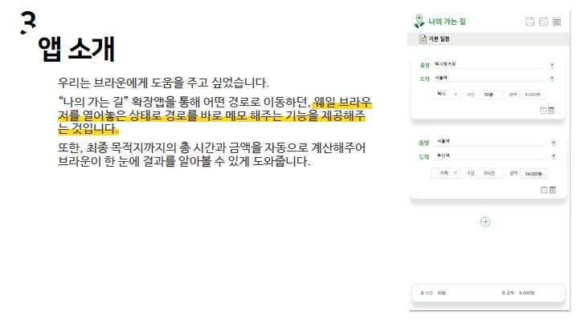

# 2019 웨일 확장앱 콘테스트 개발 이야기

수상을 한다면 돈과 웨일팀에서 인턴할 수 있는 기회를 얻을 수 있는 가희 개발자들의 오디션이라고 할 수 있겠다..

## [0] 웨일? 웨일 확장앱?
웨일은 크로미움 기반 웹 브라우저로 네이버에서 개발하였으며, DEVIEW 2016에서 처음 공개하였습니다. 크로미움 기술을 사용하기에 크롬 확장앱을 _(전부는 아니지만)_ 웨일에서 사용할 수 있습니다.

크로미움 엔진을 사용하는 브라우저는 크롬 뿐만 아니라 비발디 브라우저도 있습니다. 다른 브라우저와 다르게 처음 사용했을 때는 디자인이 예쁘고 빨랐습니다. 

점유율은 조사마다 차이가 있지만 2019년4월기준 브라우저 점유율은 Edge가 4%정도이고 웨일은 1.6%입니다. [(출처: wiki)](https://ko.wikipedia.org/wiki/%EC%9B%B9_%EB%B8%8C%EB%9D%BC%EC%9A%B0%EC%A0%80_%EC%8B%9C%EC%9E%A5_%EC%A0%90%EC%9C%A0%EC%9C%A8)

웨일 확장앱은 브라우저 화면의 1/4 정도 작은 웹 화면을 보여줄 수 있습니다. 여기에 추가 기능 혹은 편의 기능을 만들 수 있습니다. 크롬은 별도의 화면을 사용할 수 없어서 확장앱 프로그램 제작에 다소 제약이 있는 반면에 별도의 공간을 만들어서 모바일 웹을 제작하는 느낌으로 다양한 아이디어를 실현할 수 있습니다.

  

> 웨일은 이렇게 깜찍하게 생겼다.

  

## [1] 기획

|||
|------|---|
|||

> 이동하는 경로를 메모하고 체계적으로 관리하는 경로 메모 앱을 만들었습니다.

  

## [2] 결과

> 결과 나오기까지 얼마나 두군거리는지...

전날 함께 개발하는 친구와 두근거리며 결과를 기다렸습니다.

 

예상과는 다르게 5시에 오진 않았지만 본선 진출하였습니다. _(야호~)_

  

## [3] 개발

여행 관련 앱을 직접 다운로드해보고 사용해 보면서 어떻게 UI를 구성할까 고민을 많이 하였습니다.

 

|||
|------|---|
|||
이동하는 경로를 메모하고 체계적으로 관리하는 경로 메모 앱을 만들었습니다.

- 저는 프론트 디자인과 이후 버그를, 또 한명의 개발하는 친구는 백엔드 영역을 개발했습니다.

- 처음에는 Bootstrap을 활용하려고 했으나 화면이 좁고, 픽셀을 영혼끝까지 사용하기 위해서 CSS를 한땀한땀 제작했습니다. 

- 파일 및 폴더관리를 Whale API와 JQuery를 활용해서 제작하였습니다. 

- 더 좋은 디자인을 찾기 위해서 버튼 하나, 아코디언, 햄버거 메뉴 등등 참고할 만한 디자인을 많이 검색하고 보고 찾았습니다. 

|||
|------|---|
|||

  

## [4] 결과

> 탈락.. ㅠㅠ

  

## [5] 아쉬웠던 점
- 웨일 확장 프로그램 내에서 지도 API를 이용할 경우에도 돈을 내야했습니다. 웨일 내에서 네이버 API를 사용시 무료로 했다면 더욱 놀라운 웨일 확장앱을 제작할 수 있을 것입니다.

- JS 부분에서 많은 버그가 있었습니다. 특정 버튼을 눌렀을 때 동작하지 않는 등 스토어에 출시 이후 예상하지 못한 부분에서 버그가 많이 발견하여서 사후 업데이트를 3번 걸쳐서 했습니다. Testing의 중요성을 깯알았습니다.  

- 공유 기능에서 카카오톡 로그인이 정상적으로 수행되지 않았습니다. 웨일의 버그인지.. 

- 웨일에서 로그인 한 상태를 불러올 수 없었습니다. 로그인한 계정에 맞추어서 메모를 저장하고 싶었으나 해당 기능이 제공되지 않아 이 부분은 개발할 수 없었습니다.

 

## [6] 얻은 점
- __CSS Master:__ 웹 개발할 때 Frontend 작업을 한다면 Bootstrap을 이용해서 빠르게 UI를 만들고 CSS를 상속받아 원하는 방법에 맞게 수정했습니다. 콘테스트 개발 2주간 개발에 필요한 부분 CSS를 공부하는 방법으로 700라인 이상 작성했습니다. 이제는 CSS는 누어서 떡먹기 입니다. 

- __다른 사람이 사용해준다는게..:__  직접 만든 프로그램이 누군가 사용해준다는 그 짜릿함.. 잊을 수 없습니다.

- __버그 헌터__: 자다가 버그가 생각나서 새벽 4시에 일어나 수정하고 다시 잠들었습니다. 이렇게 하나에 몰입할 수 있는 경험은 정말 좋은 경험이었습니다.

 

## 총총

> 수상은 못했지만 웨일이 깜찍하게 생겨서 봐주기로했다. 

 

## 총총2

[나의 가는 길(클릭~)](https://store.whale.naver.com/detail/fokfogbddicgbklmjpmbjahojlojhklg) 많이 다운로드 해주세요~ 