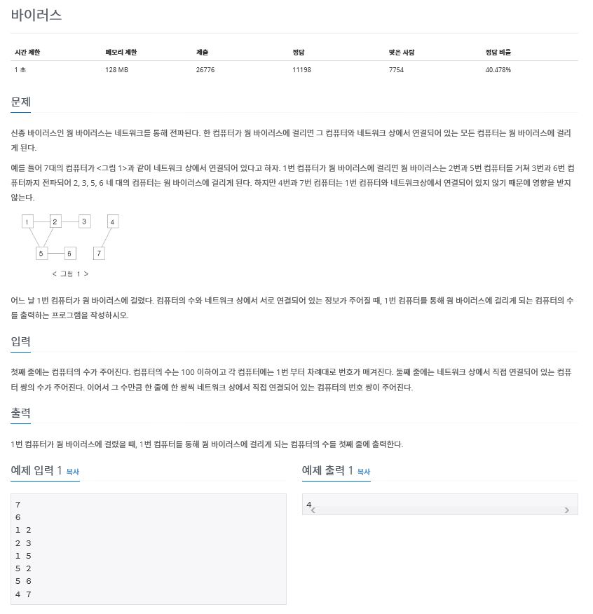

# 백준 2606번: 바이러스

### 문제
------------

* [문제 보러 가기](https://www.acmicpc.net/problem/2606)


### 풀이
- 웜 바이러스가 이동할 수 있는 컴퓨터들은 그래프의 형태로 연결되어 있다고 볼 수 있다.
- 컴퓨터 끼리는 양방향 그래프로 연결되어 있다. (1번과 2번 컴퓨터가 연결되 있다면 [1번]->[2번] 컴퓨터로 갈 뿐만 아니라 [2번]->[1번] 컴퓨터로 이동할 수 있다.)
- 웜 바이러스는 연결된 컴퓨터들끼리만 이동할 수 있기에 이는 그래프의 탐색으로 풀 수 있다.
- 본 문제를 DFS를 이용하여 풀었다.
- 문제의 맨 마지막에서 __*1번 컴퓨터를 통해 웜 바이러스에 걸리게 되는*__ 라고 한다. 즉 1번 그래프를 방문한다고 볼 수 있다.
- **따라서 1번 그래프에서 방문을 시작하여 DFA를 했을 때 방문하는 서로 다른 노드의 갯수를 세면 된다.**

### 코드
```java
import java.io.*;
import java.util.Scanner;
import java.util.ArrayList;
import java.util.Stack;

class Vertex {
  public char label;
  public boolean visited;
  public Vertex(char lab){
    label = lab;
    visited = false;
  }
}

class GraphAdjList {
  private final int maxVertices = 20;
  private Vertex vertexList[];
  private int adjMatrix[][];
  private int vertexCount;
  private Stack<Integer> theStack;
  public static int count = -1;

  public GraphAdjList(int vertexCount){
    vertexList = new Vertex[vertexCount];
    adjMatrix = new int[vertexCount][vertexCount];
    for(int y=0; y<vertexCount; y++){
      for(int x=0; x<vertexCount; x++){
        adjMatrix[x][y] = 0;
      }
    }
    theStack = new Stack<Integer>();
  }

  public void addVertex(char lab){
    vertexList[vertexCount++] = new Vertex(lab);
  }
  public void addEdge(int start, int end){
    adjMatrix[start][end] = 1;
    adjMatrix[end][start] = 1;
  }

  public void displayVertex(int v){
    count++;
  }

  public int dfs(){
    vertexList[0].visited = true;

    displayVertex(0);
    theStack.push(0);

    while(!theStack.isEmpty()){
      int v = getAdjUnvisitedVertex((int)theStack.peek());
      if(v==-1){
        theStack.pop();
      }else{
        vertexList[v].visited = true;
        displayVertex(v);
        theStack.push(v);
      }
    }
    for(int j=0; j<vertexCount;j++){
      vertexList[j].visited = false;
    }

    return count;
  }

  public int getAdjUnvisitedVertex(int v){
    for(int j=0; j<vertexCount; j++){
      if(adjMatrix[v][j] ==1 && vertexList[j].visited == false){
        return j;
      }
    }
    return -1;
  }

}

public class Main {
  public static void main(String [] args) {
    Scanner sc = new Scanner(System.in);
    int numberOfNode = sc.nextInt();
    int numberOfEdge = sc.nextInt();

    GraphAdjList g = new GraphAdjList(numberOfNode);

    for(int i=0; i<numberOfNode; i++){
      g.addVertex((char)i);
    }

    for(int i=0; i<numberOfEdge; i++){
      int u = sc.nextInt();
      int v = sc.nextInt();
      g.addEdge(u-1, v-1);
    }

    System.out.print(g.dfs());

  }
}

```

* 사족: 그래프를 직접 구현한 것을 그대로 사용하였기에 다소 복잡해 보인다.
